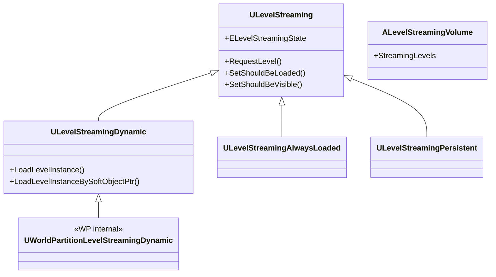

# LevelStreaming 概要

- 上位: [[01_worldbuilding_overview]]
- 関連: [[WorldPartition/01_overview]]
- ソース: `Engine/Source/Runtime/Engine/Classes/Engine/LevelStreaming*.h`、`Engine/Private/LevelStreaming.cpp`

---

## LevelStreaming とは

UE4 から存在する **レベル単位の非同期ロード/アンロード** 機能。UE5 では World Partition の内部実装としても使用される（`UWorldPartitionLevelStreamingDynamic`）。手動でサブレベルを管理する旧来方式と、WP が自動生成する動的方式の両方がある。

---

## アーキテクチャ

---

## 主要クラス

| クラス | 役割 | BP公開 |
|-------|------|--------|
| `ULevelStreaming` | レベルストリーミング基底。ロード/可視性制御 | Yes |
| `ULevelStreamingDynamic` | ランタイムでレベルをインスタンス化してロード | Yes |
| `ULevelStreamingAlwaysLoaded` | 常時ロードされるレベル | No |
| `ULevelStreamingPersistent` | PersistentLevel 用 | No |
| `UWorldPartitionLevelStreamingDynamic` | WP セルのストリーミング実装 | No |
| `ALevelStreamingVolume` | ボリュームベースのストリーミングトリガー | Yes |
| `FLevelStreamingDelegates` | ストリーミングイベントデリゲート | No |

---

## Details

| ドキュメント | 内容 |
|------------|------|
| [[Details/a_level_streaming]] | ULevelStreaming ライフサイクル・RequestLevel・非同期ロード |
| [[Details/b_seamless_travel]] | Seamless / Non-Seamless Travel・TransitionMap |
| [[Details/c_dynamic_streaming]] | ULevelStreamingDynamic・ランタイム生成・Transform |
