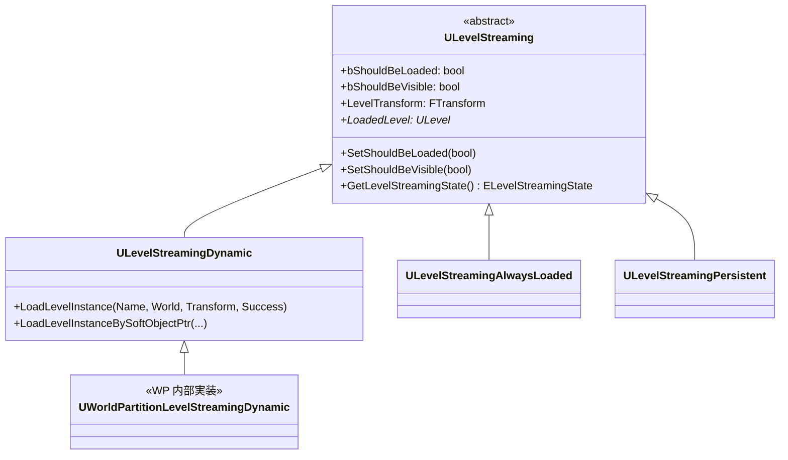
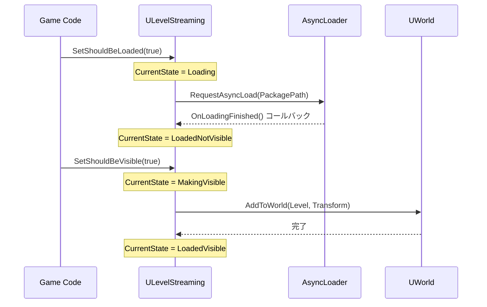

# ULevelStreaming ライフサイクル・非同期ロード

- 上位: [[LevelStreaming/01_overview]]
- ソース: `Engine/Source/Runtime/Engine/Classes/Engine/LevelStreaming.h`

---

## 概要

`ULevelStreaming` はサブレベル（`ULevel`）の非同期ロード・アンロード・表示/非表示を管理する抽象基底クラス。UE4 時代からある機能で、UE5 では World Partition が内部で `UWorldPartitionLevelStreamingDynamic`（派生クラス）を使ってセルをストリーミングする。

---

## クラス階層



---

## ELevelStreamingState — ストリーミング状態

```cpp
enum class ELevelStreamingState : uint8
{
    Removed,          // ストリーミングオブジェクトが除去済み
    Unloaded,         // アンロード状態
    FailedToLoad,     // ロード失敗
    Loading,          // ロード中（非同期）
    LoadedNotVisible, // ロード済み・非表示
    MakingVisible,    // 表示処理中（AddToWorld 中）
    LoadedVisible,    // ロード済み・表示中
    MakingInvisible,  // 非表示処理中（RemoveFromWorld 中）
};
```

---

## ELevelStreamingTargetState — 目標状態

```cpp
enum class ELevelStreamingTargetState : uint8
{
    Unloaded,            // アンロード（最終目標）
    UnloadedAndRemoved,  // アンロード後にオブジェクトも削除
    LoadedNotVisible,    // ロード済み・非表示
    LoadedVisible,       // ロード済み・表示
};
```

---

## 主要プロパティ

| プロパティ | 型 | BP公開 | 説明 |
|-----------|-----|--------|------|
| `WorldAsset` | `TSoftObjectPtr<UWorld>` | 読み取り | ロード対象のワールドアセット |
| `LevelTransform` | `FTransform` | 読み書き | ロード後のアクタ変換 |
| `StreamingPriority` | `int32` | Setter | ロード優先度（高いほど優先） |
| `bShouldBeLoaded` | `bool` | Setter/Getter | ロード要求フラグ |
| `bShouldBeVisible` | `bool` | Setter | 可視性フラグ |
| `bShouldBlockOnLoad` | `bool` | 読み書き | 同期ロード（ブロッキング） |
| `bShouldBlockOnUnload` | `bool` | 読み書き | 同期アンロード |
| `bDisableDistanceStreaming` | `bool` | 読み書き | 距離ベースの自動制御を無効化 |
| `EditorStreamingVolumes` | `TArray<ALevelStreamingVolume*>` | — | ボリュームトリガーリスト |

---

## 主要メソッド

### 状態制御

```cpp
// ロード要求（true でロード開始）
UFUNCTION(BlueprintSetter)
void SetShouldBeLoaded(bool bInShouldBeLoaded);

// 可視性制御（true でワールドに追加・AddToWorld）
UFUNCTION(BlueprintSetter)
void SetShouldBeVisible(bool bInShouldBeVisible);

// 優先度設定
UFUNCTION(BlueprintSetter)
void SetPriority(int32 NewPriority);

// 一時的な優先度オーバーライド
void SetPriorityOverride(int32 PriorityOverride);
void ResetPriorityOverride();
```

### 状態確認

```cpp
// 現在のストリーミング状態
ELevelStreamingState GetLevelStreamingState() const;

// ロードリクエスト保留中か
bool HasLoadRequestPending() const;

// ロード済みレベルが存在するか
bool HasLoadedLevel() const;

// アンロード・削除要求フラグ
UFUNCTION(BlueprintPure, Category = LevelStreaming)
bool GetIsRequestingUnloadAndRemoval() const;

UFUNCTION(BlueprintCallable, Category = LevelStreaming)
void SetIsRequestingUnloadAndRemoval(bool bInIsRequestingUnloadAndRemoval);
```

---

## 非同期ロードフロー



### 非同期ロードの実装詳細

`AsyncRequestIDs` に非同期リクエスト ID を格納し、`OnLoadingFinished()` で ID をクリア。ロード完了は次フレームの `UWorld::UpdateLevelStreaming()` で検出される。

---

## デリゲート（BP アサイン可能）

```cpp
// ロード完了イベント
UPROPERTY(BlueprintAssignable)
FLevelStreamingLoadedStatus OnLevelLoaded;

// アンロード完了イベント
UPROPERTY(BlueprintAssignable)
FLevelStreamingLoadedStatus OnLevelUnloaded;

// 表示完了イベント（AddToWorld 完了）
UPROPERTY(BlueprintAssignable)
FLevelStreamingVisibilityStatus OnLevelShown;

// 非表示完了イベント（RemoveFromWorld 完了）
UPROPERTY(BlueprintAssignable)
FLevelStreamingVisibilityStatus OnLevelHidden;
```

---

## ALevelStreamingVolume — ボリュームトリガー

```cpp
UCLASS(MinimalAPI)
class ALevelStreamingVolume : public AVolume
{
    // 対象レベルストリーミングオブジェクト
    UPROPERTY(EditAnywhere, Category = LevelStreaming)
    TArray<TLazyObjectPtr<class ULevelStreaming>> StreamingLevels;

    // ロードのみ（表示しない）
    UPROPERTY(EditAnywhere, Category = LevelStreaming)
    bool bDisabled;
};
```

プレイヤーがボリュームに入ると自動的に `SetShouldBeLoaded(true)` / `SetShouldBeVisible(true)` が呼ばれる。

---

## CVars

| CVar | 説明 |
|------|------|
| `s.LevelStreamingActorsUpdateTimeLimit` | AddToWorld でアクタ追加に使える時間制限（ms）|
| `s.UnregisterComponentsTimeLimit` | RemoveFromWorld でのコンポーネント登録解除制限 |
| `s.PriorityLevelStreamingActorsUpdateExtraTime` | 高優先度レベルへの追加時間 |
