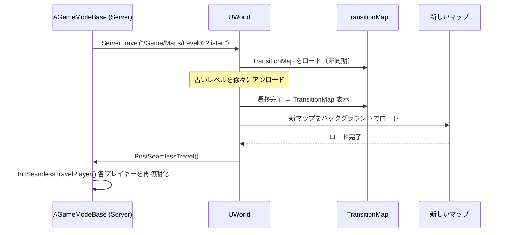

# Seamless / Non-Seamless Travel・TransitionMap

- 上位: [[LevelStreaming/01_overview]]
- ソース: `Engine/Source/Runtime/Engine/Classes/GameFramework/GameModeBase.h`
          `Engine/Source/Runtime/Engine/Classes/Engine/Engine.h`

---

## 概要

UE ではレベル（マップ）間の移動に **Seamless Travel** と **Non-Seamless Travel** の 2 種類がある。Seamless はバックグラウンドで新レベルをロードするためプレイヤーが切断されない。

---

## 比較

| 特徴 | Seamless Travel | Non-Seamless Travel |
|------|---------------|-------------------|
| 接続維持 | 維持（クライアント切断なし） | 切断して再接続 |
| ロード方式 | 非同期（TransitionMap 経由） | 同期（ブラック画面） |
| アクタ引き継ぎ | 可能（PlayerController 等） | 不可 |
| 速度 | 遅い（バックグラウンド） | 速い（単純） |
| シングルプレイ | 対応 | 対応 |
| マルチプレイ | 推奨 | 非推奨（切断が必要） |

---

## Seamless Travel の設定

### GameMode での有効化

```cpp
// AGameModeBase のプロパティ
UPROPERTY(EditDefaultsOnly, Category=GameMode)
uint32 bUseSeamlessTravel : 1;  // デフォルト false → true に設定

// Project Settings → Maps & Modes → Transition Map でも設定可
```

### TransitionMap の役割

Seamless Travel は必ず **TransitionMap**（中間マップ）を経由する。

```
現在のマップ → TransitionMap（ローディング画面等）→ 目的地マップ
```

TransitionMap は `Project Settings → Maps & Modes → Transition Map` で設定する。

---

## Travel の実行方法

### サーバー側（`AGameModeBase::ProcessServerTravel`）

```cpp
// URL 形式でレベルを指定
void AMyGameMode::TravelToNextLevel()
{
    // Absolute パスの場合は "/" プレフィックス
    // Seamless の場合は "?listen" を追加（マルチ）
    GetWorld()->ServerTravel(TEXT("/Game/Maps/Level02?listen"), /*bAbsolute=*/false);
}
```

### クライアント側（`APlayerController::ClientTravel`）

```cpp
// シングルプレイでは ClientTravel で直接移動
PlayerController->ClientTravel(TEXT("/Game/Maps/Level02"), TRAVEL_Relative);
```

### `ETravelType` 列挙

```cpp
enum class ETravelType
{
    TRAVEL_Absolute,  // 絶対パスで新マップへ
    TRAVEL_Partial,   // 一部のアクタを保持して移動
    TRAVEL_Relative,  // 現在マップからの相対
};
```

---

## Seamless Travel フロー



---

## アクタの引き継ぎ

Seamless Travel 中に PlayerController などを新マップに引き継げる。

### サーバー側（GameMode でオーバーライド）

```cpp
// 引き継ぐアクタを追加
virtual void GetSeamlessTravelActorList(
    bool bToTransition,
    TArray<AActor*>& ActorList) override
{
    Super::GetSeamlessTravelActorList(bToTransition, ActorList);

    // TransitionMap への遷移時（bToTransition=true）
    // 新マップへの遷移時（bToTransition=false）
    if (!bToTransition)
    {
        // カスタムアクタを引き継ぎ
        ActorList.Add(MyPersistentActor);
    }
}
```

### クライアント側（PlayerController でオーバーライド）

```cpp
virtual void GetSeamlessTravelActorList(
    bool bToTransition,
    TArray<AActor*>& ActorList) override;
```

---

## Non-Seamless Travel

シンプルな `UGameplayStatics::OpenLevel` / `GetWorld()->ServerTravel` で `bUseSeamlessTravel = false` の場合に実行される。

```cpp
// BP でのレベル遷移（Non-Seamless）
UGameplayStatics::OpenLevel(this, TEXT("/Game/Maps/Level02"));

// C++ での ServerTravel
GetWorld()->ServerTravel(TEXT("/Game/Maps/Level02"), /*bAbsolute=*/true);
```

### Non-Seamless の注意点

- マルチプレイでは全クライアントが切断されるため推奨されない
- ロード画面（BlockingLoad）が必要
- 単純な実装でシングルプレイには十分

---

## FSeamlessTravelHandler

UE 内部では `FSeamlessTravelHandler`（`Engine.h` の内部クラス）が Seamless Travel の状態機械を管理する。

```cpp
// 現在 Seamless Travel 中か確認
bool UWorld::IsInSeamlessTravel() const;

// 移動先 URL の取得
FString UWorld::GetSeamlessTravelDestinationURL() const;
```

---

## 関連イベント

| GameMode コールバック | タイミング |
|-------------------|---------|
| `PostSeamlessTravel()` | 新マップのロード完了後 |
| `HandleSeamlessTravelPlayer(AController*)` | 各プレイヤーを新マップに移行する時 |
| `GetPlayerControllerClassToSpawnForSeamlessTravel(...)` | 新マップで生成するPC クラスを決定 |
