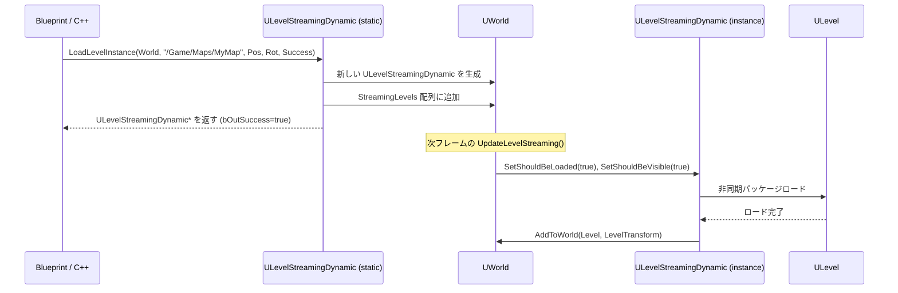

# ULevelStreamingDynamic・ランタイム生成・Transform

- 上位: [[LevelStreaming/01_overview]]
- ソース: `Engine/Source/Runtime/Engine/Classes/Engine/LevelStreamingDynamic.h`

---

## 概要

`ULevelStreamingDynamic` は**ランタイムでレベルを動的にインスタンス化**するためのクラス。同じレベルアセットを異なる位置・回転・スケールで複数ロードできる（Level Instance）。World Partition の動的ストリーミングも内部でこのクラスを使用する。

---

## クラス定義

```cpp
UCLASS(BlueprintType, MinimalAPI)
class ULevelStreamingDynamic : public ULevelStreaming
{
    // 起動時にロードするか
    UPROPERTY(EditAnywhere, Category=LevelStreaming)
    uint32 bInitiallyLoaded : 1;

    // 起動時に表示するか
    UPROPERTY(EditAnywhere, Category=LevelStreaming)
    uint32 bInitiallyVisible : 1;
};
```

---

## 主要静的メソッド（BP 公開）

### LoadLevelInstance（名前指定）

```cpp
UFUNCTION(BlueprintCallable, Category = LevelStreaming,
          meta=(DisplayName="Load Level Instance (by Name)",
                WorldContext="WorldContextObject"))
static ULevelStreamingDynamic* LoadLevelInstance(
    UObject* WorldContextObject,
    FString LevelName,           // "/Game/Maps/MyLevel"（フルパス推奨）
    FVector Location,            // ワールド座標
    FRotator Rotation,           // ワールド回転
    bool& bOutSuccess,           // 成功フラグ（出力）
    const FString& OptionalLevelNameOverride = TEXT(""), // サーバー/クライアント同期用
    TSubclassOf<ULevelStreamingDynamic> OptionalLevelStreamingClass = {},
    bool bLoadAsTempPackage = false
);
```

### LoadLevelInstanceBySoftObjectPtr（アセット参照指定）

```cpp
UFUNCTION(BlueprintCallable, Category = LevelStreaming,
          meta=(DisplayName="Load Level Instance (by Object Reference)",
                WorldContext="WorldContextObject"))
static ULevelStreamingDynamic* LoadLevelInstanceBySoftObjectPtr(
    UObject* WorldContextObject,
    TSoftObjectPtr<UWorld> Level, // ソフト参照（BP で設定可）
    FVector Location,
    FRotator Rotation,
    bool& bOutSuccess,
    const FString& OptionalLevelNameOverride = TEXT(""),
    TSubclassOf<ULevelStreamingDynamic> OptionalLevelStreamingClass = {},
    bool bLoadAsTempPackage = false
);
```

---

## FLoadLevelInstanceParams — C++ 詳細設定

```cpp
struct FLoadLevelInstanceParams
{
    UWorld* World;                          // ロード先ワールド
    FString LongPackageName;               // 完全パッケージ名
    FTransform LevelTransform;             // ロード位置・回転・スケール

    const FString* OptionalLevelNameOverride;  // ネットワーク同期用名前
    TSubclassOf<ULevelStreamingDynamic> OptionalLevelStreamingClass;
    bool bLoadAsTempPackage;               // /Temp プレフィックスでロード
    bool bInitiallyVisible;                // 初期表示フラグ（デフォルト true）
    bool bAllowReuseExitingLevelStreaming; // 既存オブジェクトの再利用

    // ストリーミングオブジェクト生成後のコールバック
    TUniqueFunction<void(ULevelStreaming*)> LevelStreamingCreatedCallback;
};
```

---

## 動的ロードフロー



---

## Transform の適用

`LevelTransform` は `ULevelStreaming::LevelTransform` プロパティとして保存され、`AddToWorld` 時に全アクタに適用される。

```cpp
// C++ での transform 変更
ULevelStreamingDynamic* LSObj = LoadLevelInstance(...);
if (LSObj)
{
    // ロード前に変更可能（ロード後の変更は非対応）
    LSObj->LevelTransform = FTransform(Rotation, Location, FVector::OneVector);
}
```

### 制限事項

- ロード後の Transform 変更は公式サポート外（アクタを移動させる必要がある）
- スケールは `FVector::OneVector`（1,1,1）以外を使う場合は物理・コリジョンへの影響に注意

---

## サブレベルのアンロード

```cpp
// ランタイムでのアンロード
void UnloadLevel(ULevelStreamingDynamic* StreamingLevel)
{
    if (StreamingLevel)
    {
        StreamingLevel->SetShouldBeVisible(false);
        StreamingLevel->SetShouldBeLoaded(false);
        StreamingLevel->SetIsRequestingUnloadAndRemoval(true); // オブジェクトも削除
    }
}
```

---

## BP での使用例

```
EventBeginPlay →
    LoadLevelInstance(
        WorldContext = Self,
        LevelName = "/Game/Levels/DynamicLevel",
        Location = (1000, 0, 0),
        Rotation = (0, 0, 0),
        Success → (out)
    ) → StreamingObj

→ StreamingObj.OnLevelShown.AddDynamic(OnLevelReady)
```

---

## 注意事項

- `LevelName` はショートネーム（`MyLevel`）より **フルパス**（`/Game/Maps/MyLevel`）を推奨。ショートネームはディスク検索を強制してパフォーマンス低下する
- マルチプレイヤーではサーバーとクライアントで **同じパッケージ名**（`OptionalLevelNameOverride`）を使う必要がある
- パッケージングするには **Project Settings → Packaging → Maps to Include** にマップを追加する
