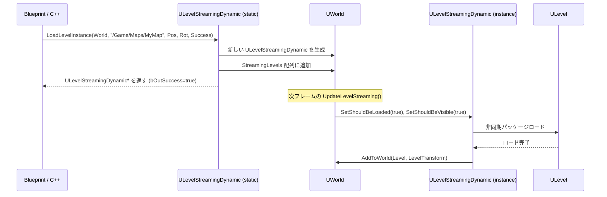

# ULevelStreamingDynamic・ランタイム生成・Transform

- 上位: [[LevelStreaming/01_overview]]
- ソース: `Engine/Source/Runtime/Engine/Classes/Engine/LevelStreamingDynamic.h`

---

## 概要

`ULevelStreamingDynamic` は**ランタイムでレベルを動的にインスタンス化**するためのクラス。同じレベルアセットを異なる位置・回転・スケールで複数ロードできる（Level Instance）。World Partition の動的ストリーミングも内部でこのクラスを使用する。

---

## クラス定義

```cpp
UCLASS(BlueprintType, MinimalAPI)
class ULevelStreamingDynamic : public ULevelStreaming
{
    // 起動時にロードするか
    UPROPERTY(EditAnywhere, Category=LevelStreaming)
    uint32 bInitiallyLoaded : 1;

    // 起動時に表示するか
    UPROPERTY(EditAnywhere, Category=LevelStreaming)
    uint32 bInitiallyVisible : 1;
};
```

---

## 主要静的メソッド（BP 公開）

### LoadLevelInstance（名前指定）

```cpp
UFUNCTION(BlueprintCallable, Category = LevelStreaming,
          meta=(DisplayName="Load Level Instance (by Name)",
                WorldContext="WorldContextObject"))
static ULevelStreamingDynamic* LoadLevelInstance(
    UObject* WorldContextObject,
    FString LevelName,           // "/Game/Maps/MyLevel"（フルパス推奨）
    FVector Location,            // ワールド座標
    FRotator Rotation,           // ワールド回転
    bool& bOutSuccess,           // 成功フラグ（出力）
    const FString& OptionalLevelNameOverride = TEXT(""), // サーバー/クライアント同期用
    TSubclassOf<ULevelStreamingDynamic> OptionalLevelStreamingClass = {},
    bool bLoadAsTempPackage = false
);
```

### LoadLevelInstanceBySoftObjectPtr（アセット参照指定）

```cpp
UFUNCTION(BlueprintCallable, Category = LevelStreaming,
          meta=(DisplayName="Load Level Instance (by Object Reference)",
                WorldContext="WorldContextObject"))
static ULevelStreamingDynamic* LoadLevelInstanceBySoftObjectPtr(
    UObject* WorldContextObject,
    TSoftObjectPtr<UWorld> Level, // ソフト参照（BP で設定可）
    FVector Location,
    FRotator Rotation,
    bool& bOutSuccess,
    const FString& OptionalLevelNameOverride = TEXT(""),
    TSubclassOf<ULevelStreamingDynamic> OptionalLevelStreamingClass = {},
    bool bLoadAsTempPackage = false
);
```

---

## FLoadLevelInstanceParams — C++ 詳細設定

```cpp
struct FLoadLevelInstanceParams
{
    UWorld* World;                          // ロード先ワールド
    FString LongPackageName;               // 完全パッケージ名
    FTransform LevelTransform;             // ロード位置・回転・スケール

    const FString* OptionalLevelNameOverride;  // ネットワーク同期用名前
    TSubclassOf<ULevelStreamingDynamic> OptionalLevelStreamingClass;
    bool bLoadAsTempPackage;               // /Temp プレフィックスでロード
    bool bInitiallyVisible;                // 初期表示フラグ（デフォルト true）
    bool bAllowReuseExitingLevelStreaming; // 既存オブジェクトの再利用

    // ストリーミングオブジェクト生成後のコールバック
    TUniqueFunction<void(ULevelStreaming*)> LevelStreamingCreatedCallback;
};
```

---

## 動的ロードフロー



---

## Transform の適用

`LevelTransform` は `ULevelStreaming::LevelTransform` プロパティとして保存され、`AddToWorld` 時に全アクタに適用される。

```cpp
// C++ での transform 変更
ULevelStreamingDynamic* LSObj = LoadLevelInstance(...);
if (LSObj)
{
    // ロード前に変更可能（ロード後の変更は非対応）
    LSObj->LevelTransform = FTransform(Rotation, Location, FVector::OneVector);
}
```

### 制限事項

- ロード後の Transform 変更は公式サポート外（アクタを移動させる必要がある）
- スケールは `FVector::OneVector`（1,1,1）以外を使う場合は物理・コリジョンへの影響に注意

---

## サブレベルのアンロード

```cpp
// ランタイムでのアンロード
void UnloadLevel(ULevelStreamingDynamic* StreamingLevel)
{
    if (StreamingLevel)
    {
        StreamingLevel->SetShouldBeVisible(false);
        StreamingLevel->SetShouldBeLoaded(false);
        StreamingLevel->SetIsRequestingUnloadAndRemoval(true); // オブジェクトも削除
    }
}
```

---

## BP での使用例

```
EventBeginPlay →
    LoadLevelInstance(
        WorldContext = Self,
        LevelName = "/Game/Levels/DynamicLevel",
        Location = (1000, 0, 0),
        Rotation = (0, 0, 0),
        Success → (out)
    ) → StreamingObj

→ StreamingObj.OnLevelShown.AddDynamic(OnLevelReady)
```

---

## 注意事項

- `LevelName` はショートネーム（`MyLevel`）より **フルパス**（`/Game/Maps/MyLevel`）を推奨。ショートネームはディスク検索を強制してパフォーマンス低下する
- マルチプレイヤーではサーバーとクライアントで **同じパッケージ名**（`OptionalLevelNameOverride`）を使う必要がある
- パッケージングするには **Project Settings → Packaging → Maps to Include** にマップを追加する

---

## コード実行フロー

### エントリポイント

```
[BP/C++ 起点]
ULevelStreamingDynamic::LoadLevelInstance(World, Name, Loc, Rot, Success)        [LevelStreamingDynamic.cpp]
  └─ LoadLevelInstance_Internal(Params: FLoadLevelInstanceParams)
       ├─ LongPackageName 正規化（/Game/Maps/... に変換）
       ├─ OptionalLevelNameOverride でマルチ同期用名前を決定
       ├─ 既存 ULevelStreaming の再利用可否判定
       │    └─ bAllowReuseExistingLevelStreaming && 同名既存あり → 既存返却
       ├─ NewObject<ULevelStreamingDynamic>(World, Class)
       │    ├─ WorldAsset = TSoftObjectPtr<UWorld>(LongPackageName)
       │    ├─ LevelTransform = Params.LevelTransform
       │    ├─ bInitiallyVisible = Params.bInitiallyVisible
       │    └─ SetShouldBeLoaded(true)
       ├─ World->AddStreamingLevel(NewObj)
       │    └─ UWorld::StreamingLevels.Add(NewObj)
       │    └─ FStreamingLevelsToConsider に登録
       ├─ Params.LevelStreamingCreatedCallback(NewObj)
       └─ return NewObj  (bOutSuccess=true)

[次フレーム以降は通常の LevelStreaming フロー]
UWorld::UpdateLevelStreaming()  [World.cpp:4932]
  └─ ULevelStreaming::UpdateStreamingState()  [LevelStreaming.cpp:992]
       └─ RequestLevel() → LoadPackageAsync()
            └─ AsyncLoadCallback() → SetLoadedLevel()
       └─ ULevel::AddToWorld(LoadedLevel, LevelTransform)  ← Transform 適用
            └─ OnLevelShown.Broadcast()

[WP セル用派生クラス]
UWorldPartitionLevelStreamingDynamic::Create(Cell)
  └─ ULevelStreamingDynamic から派生し、セル専用のパッケージ解決ロジック追加
       └─ UWorldPartition::Initialize 時に各セルに対し 1 インスタンス生成
```

### フロー詳細

1. **静的ファクトリ** — `LoadLevelInstance()` は静的メソッドで、内部で `LoadLevelInstance_Internal(FLoadLevelInstanceParams)` に委譲。BP からは `bOutSuccess` 出力付きのシンプル版、C++ は詳細パラメータ版を使い分け。
2. **名前正規化** — `LongPackageName` はフルパス推奨。ショートネーム（`MyLevel`）は `FPackageName::SearchForPackageOnDisk()` が走りパフォーマンス低下。ネットワーク同期には `OptionalLevelNameOverride` でサーバー/クライアント共通名を指定。
3. **既存再利用** — `bAllowReuseExistingLevelStreaming=true` かつ同名の `ULevelStreaming` が既にあれば再利用。ロード済みなら即 Visible 化できる。
4. **インスタンス生成** — `NewObject<ULevelStreamingDynamic>` で World 配下に作成。`LevelTransform` で位置を指定、`bInitiallyVisible` で初期表示を制御。`SetShouldBeLoaded(true)` を呼んだ時点で次フレームのロード開始が確定。
5. **StreamingLevels 登録** — `UWorld::AddStreamingLevel()` が内部配列に追加し `FStreamingLevelsToConsider` にも登録。以降は通常の `UpdateLevelStreaming` ループで処理（[[a_level_streaming]]）。
6. **Transform 適用タイミング** — `LevelTransform` は `AddToWorld()` 実行時にワールド内アクタへ一括適用。`UTransformTrackerBase` が `ULevel::MoveLevel()` 経由で位置を反映。ロード後の動的変更は公式非対応。
7. **コールバック** — `LevelStreamingCreatedCallback` は生成直後・ロード開始前に呼ばれ、`OnLevelShown`/`OnLevelLoaded` デリゲートのバインドに使うのが典型パターン。
8. **アンロード** — `SetIsRequestingUnloadAndRemoval(true)` にすると `UpdateStreamingState` が `UnloadedAndRemoved` ターゲットへ遷移、GC で `ULevelStreamingDynamic` 自体も破棄。
9. **WP 派生クラス** — `UWorldPartitionLevelStreamingDynamic` は `ULevelStreamingDynamic` を継承し、セルパッケージ解決を WP 側に委譲。ストリーミングポリシーから `SetShouldBeLoaded/Visible` を呼ぶだけで本フローが動く（[[WorldPartition/Details/d_runtime_cell]]）。
10. **マルチプレイヤー** — サーバー/クライアントで `OptionalLevelNameOverride` を同値にしないと、レベル内アクタのレプリケーションが対応付けできず不一致を起こす。`TEXT("Unique_Name_01")` 等の一意名を両側で指定。

### 関与クラス・関数一覧

| クラス / 関数 | ファイル | 役割 |
|-------------|---------|------|
| `ULevelStreamingDynamic::LoadLevelInstance` | `LevelStreamingDynamic.cpp` | BP エントリ |
| `ULevelStreamingDynamic::LoadLevelInstanceBySoftObjectPtr` | `LevelStreamingDynamic.cpp` | ソフト参照版 |
| `ULevelStreamingDynamic::LoadLevelInstance_Internal` | `LevelStreamingDynamic.cpp` | 実装本体 |
| `FLoadLevelInstanceParams` | `LevelStreamingDynamic.h` | 詳細パラメータ |
| `UWorld::AddStreamingLevel` | `World.cpp` | StreamingLevels 登録 |
| `ULevel::MoveLevel` | `Level.cpp` | LevelTransform 適用 |
| `UWorldPartitionLevelStreamingDynamic` | `WorldPartition/WorldPartitionLevelStreamingDynamic.cpp` | WP セル専用 |
