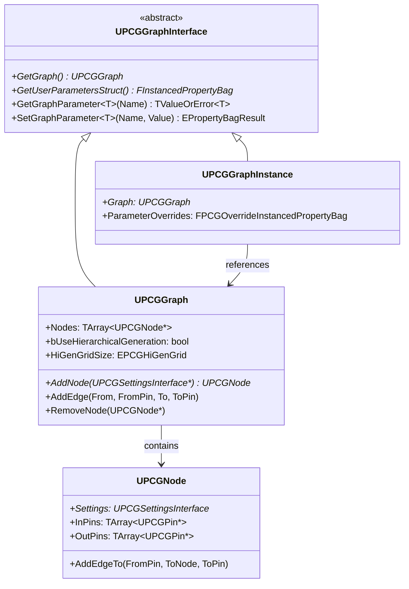
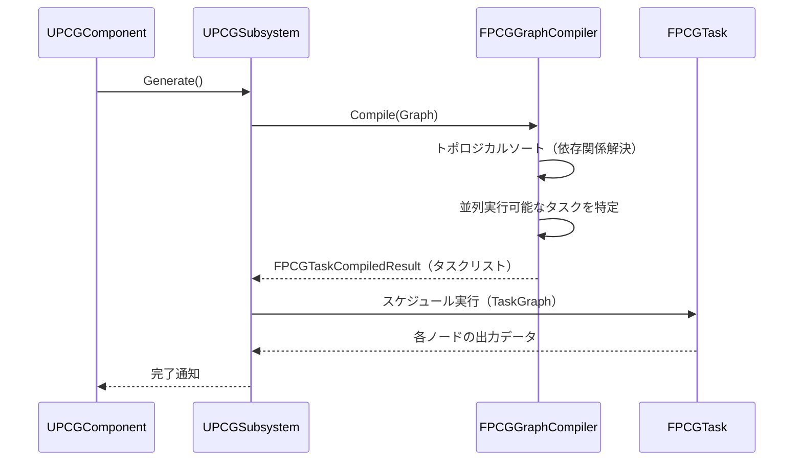

# PCG グラフ構造・コンパイル・評価順序

- 上位: [[PCG/01_overview]]
- ソース: `Engine/Plugins/PCG/Source/PCG/Public/PCGGraph.h`
          `Engine/Plugins/PCG/Source/PCG/Public/PCGNode.h`

---

## 概要

PCG グラフ（`UPCGGraph`）はノード（`UPCGNode`）をエッジで接続した DAG（有向非巡回グラフ）。コンパイラ（`FPCGGraphCompiler`）が評価順序を計算し、`UPCGComponent::Generate()` から実行される。

---

## クラス階層



---

## UPCGGraph の主要メソッド

```cpp
// ノード追加
UFUNCTION(BlueprintCallable, Category = Graph)
UPCGNode* AddNodeOfType(TSubclassOf<UPCGSettings> InSettingsClass,
                         UPCGSettings*& DefaultNodeSettings);

UFUNCTION(BlueprintCallable, Category = Graph)
UPCGNode* AddNodeInstance(UPCGSettings* InSettings);

UFUNCTION(BlueprintCallable, Category = Graph)
UPCGNode* AddNodeCopy(const UPCGSettings* InSettings, UPCGSettings*& OutCopied);

// ノード削除
UFUNCTION(BlueprintCallable, Category = Graph)
void RemoveNode(UPCGNode* InNode);

// エッジ管理
UFUNCTION(BlueprintCallable, Category = Graph)
UPCGNode* AddEdge(UPCGNode* From, const FName& FromPin,
                   UPCGNode* To, const FName& ToPin);

UFUNCTION(BlueprintCallable, Category = Graph)
bool RemoveEdge(UPCGNode* From, const FName& FromLabel,
                UPCGNode* To, const FName& ToLabel);

// ノード取得
UFUNCTION(BlueprintCallable, Category = Graph)
const TArray<UPCGNode*>& GetNodes() const;

// 入力・出力ノード
UFUNCTION(BlueprintCallable, Category = Graph)
UPCGNode* GetInputNode() const;
UPCGNode* GetOutputNode() const;
```

---

## UPCGNode の構造

```cpp
UCLASS(MinimalAPI, ClassGroup = (Procedural))
class UPCGNode : public UObject
{
    // ノードの設定オブジェクト（実行ロジックを定義）
    UPROPERTY()
    TObjectPtr<UPCGSettingsInterface> SettingsInterface;

    // 入力ピン（データを受け取る）
    UPROPERTY()
    TArray<TObjectPtr<UPCGPin>> InputPins;

    // 出力ピン（データを出力する）
    UPROPERTY()
    TArray<TObjectPtr<UPCGPin>> OutputPins;

    // エディタ上の座標
    UPROPERTY()
    int32 PositionX;
    UPROPERTY()
    int32 PositionY;

public:
    // エッジ追加
    UFUNCTION(BlueprintCallable, Category = Node)
    UPCGNode* AddEdgeTo(FName FromPinLabel, UPCGNode* To, FName ToPinLabel);

    // エッジ削除
    UFUNCTION(BlueprintCallable, Category = Node)
    bool RemoveEdgeTo(FName FromPin, UPCGNode* To, FName ToPin);

    // 所属グラフ取得
    UFUNCTION(BlueprintCallable, Category = Node)
    UPCGGraph* GetGraph() const;
};
```

---

## グラフコンパイルと評価順序

### FPCGGraphCompiler

グラフ実行前に `FPCGGraphCompiler` が DAG をトポロジカルソートして **タスクリスト** を生成する。



### 評価ルール

1. 入力ノードから出力ノードへ DAG をトポロジカルソート
2. 依存関係のないノードは**並列実行可能**
3. `Loop` ノード・再帰的サブグラフは特殊処理
4. キャッシュ機能：同一設定・同一入力なら再実行をスキップ

---

## グラフパラメーター（ユーザーパラメーター）

UE5.3 以降、グラフに `FInstancedPropertyBag` ベースのユーザーパラメーターを追加できる。`UPCGGraphInstance` でグラフをインスタンス化してパラメーターをオーバーライドすることで、同一グラフを異なる設定で使い回せる。

```cpp
// C++ でのパラメーター操作
UPCGGraphInterface* GraphInterface = Component->GetGraph();

// パラメーター取得
auto Result = GraphInterface->GetGraphParameter<float>(TEXT("Density"));
if (Result.HasValue())
{
    float Density = Result.GetValue();
}

// パラメーター設定
GraphInterface->SetGraphParameter(TEXT("Density"), 0.5f);
```

---

## 階層的生成（HierarchicalGeneration）

`bUseHierarchicalGeneration = true` を有効にすると、グラフを複数の LOD グリッドで実行できる。グリッドサイズ（`EPCGHiGenGrid`）に応じてどのノードを実行するかを制御する。大規模な地形・植生生成に使用。

| グリッド | 用途 |
|---------|------|
| 小グリッド（256m） | 高密度な詳細オブジェクト |
| 中グリッド（1024m） | 中程度のオブジェクト |
| 大グリッド（4096m） | 遠景オブジェクト |

---

## 2D グリッドモード

```cpp
bool Use2DGrid() const { return bUse2DGrid; }
```

`bUse2DGrid = true` でワールドを 2D（XY）グリッドに分割。Z 方向を無視するフラット地形に適している。
