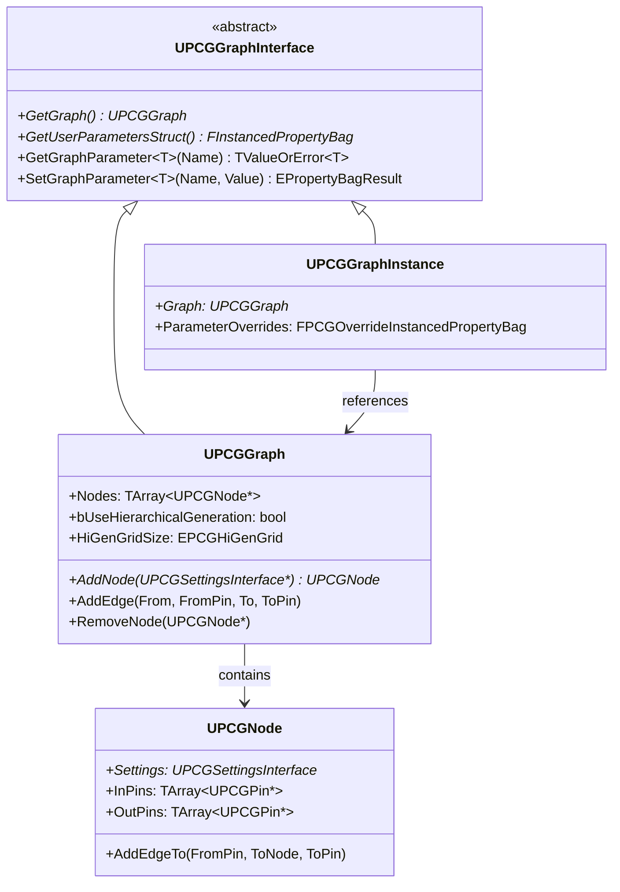
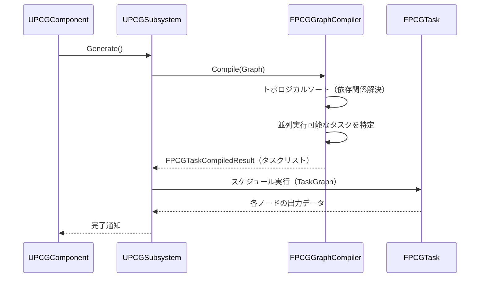

# PCG グラフ構造・コンパイル・評価順序

- 上位: [[PCG/01_overview]]
- ソース: `Engine/Plugins/PCG/Source/PCG/Public/PCGGraph.h`
          `Engine/Plugins/PCG/Source/PCG/Public/PCGNode.h`

---

## 概要

PCG グラフ（`UPCGGraph`）はノード（`UPCGNode`）をエッジで接続した DAG（有向非巡回グラフ）。コンパイラ（`FPCGGraphCompiler`）が評価順序を計算し、`UPCGComponent::Generate()` から実行される。

---

## クラス階層



---

## UPCGGraph の主要メソッド

```cpp
// ノード追加
UFUNCTION(BlueprintCallable, Category = Graph)
UPCGNode* AddNodeOfType(TSubclassOf<UPCGSettings> InSettingsClass,
                         UPCGSettings*& DefaultNodeSettings);

UFUNCTION(BlueprintCallable, Category = Graph)
UPCGNode* AddNodeInstance(UPCGSettings* InSettings);

UFUNCTION(BlueprintCallable, Category = Graph)
UPCGNode* AddNodeCopy(const UPCGSettings* InSettings, UPCGSettings*& OutCopied);

// ノード削除
UFUNCTION(BlueprintCallable, Category = Graph)
void RemoveNode(UPCGNode* InNode);

// エッジ管理
UFUNCTION(BlueprintCallable, Category = Graph)
UPCGNode* AddEdge(UPCGNode* From, const FName& FromPin,
                   UPCGNode* To, const FName& ToPin);

UFUNCTION(BlueprintCallable, Category = Graph)
bool RemoveEdge(UPCGNode* From, const FName& FromLabel,
                UPCGNode* To, const FName& ToLabel);

// ノード取得
UFUNCTION(BlueprintCallable, Category = Graph)
const TArray<UPCGNode*>& GetNodes() const;

// 入力・出力ノード
UFUNCTION(BlueprintCallable, Category = Graph)
UPCGNode* GetInputNode() const;
UPCGNode* GetOutputNode() const;
```

---

## UPCGNode の構造

```cpp
UCLASS(MinimalAPI, ClassGroup = (Procedural))
class UPCGNode : public UObject
{
    // ノードの設定オブジェクト（実行ロジックを定義）
    UPROPERTY()
    TObjectPtr<UPCGSettingsInterface> SettingsInterface;

    // 入力ピン（データを受け取る）
    UPROPERTY()
    TArray<TObjectPtr<UPCGPin>> InputPins;

    // 出力ピン（データを出力する）
    UPROPERTY()
    TArray<TObjectPtr<UPCGPin>> OutputPins;

    // エディタ上の座標
    UPROPERTY()
    int32 PositionX;
    UPROPERTY()
    int32 PositionY;

public:
    // エッジ追加
    UFUNCTION(BlueprintCallable, Category = Node)
    UPCGNode* AddEdgeTo(FName FromPinLabel, UPCGNode* To, FName ToPinLabel);

    // エッジ削除
    UFUNCTION(BlueprintCallable, Category = Node)
    bool RemoveEdgeTo(FName FromPin, UPCGNode* To, FName ToPin);

    // 所属グラフ取得
    UFUNCTION(BlueprintCallable, Category = Node)
    UPCGGraph* GetGraph() const;
};
```

---

## グラフコンパイルと評価順序

### FPCGGraphCompiler

グラフ実行前に `FPCGGraphCompiler` が DAG をトポロジカルソートして **タスクリスト** を生成する。



### 評価ルール

1. 入力ノードから出力ノードへ DAG をトポロジカルソート
2. 依存関係のないノードは**並列実行可能**
3. `Loop` ノード・再帰的サブグラフは特殊処理
4. キャッシュ機能：同一設定・同一入力なら再実行をスキップ

---

## グラフパラメーター（ユーザーパラメーター）

UE5.3 以降、グラフに `FInstancedPropertyBag` ベースのユーザーパラメーターを追加できる。`UPCGGraphInstance` でグラフをインスタンス化してパラメーターをオーバーライドすることで、同一グラフを異なる設定で使い回せる。

```cpp
// C++ でのパラメーター操作
UPCGGraphInterface* GraphInterface = Component->GetGraph();

// パラメーター取得
auto Result = GraphInterface->GetGraphParameter<float>(TEXT("Density"));
if (Result.HasValue())
{
    float Density = Result.GetValue();
}

// パラメーター設定
GraphInterface->SetGraphParameter(TEXT("Density"), 0.5f);
```

---

## 階層的生成（HierarchicalGeneration）

`bUseHierarchicalGeneration = true` を有効にすると、グラフを複数の LOD グリッドで実行できる。グリッドサイズ（`EPCGHiGenGrid`）に応じてどのノードを実行するかを制御する。大規模な地形・植生生成に使用。

| グリッド | 用途 |
|---------|------|
| 小グリッド（256m） | 高密度な詳細オブジェクト |
| 中グリッド（1024m） | 中程度のオブジェクト |
| 大グリッド（4096m） | 遠景オブジェクト |

---

## 2D グリッドモード

```cpp
bool Use2DGrid() const { return bUse2DGrid; }
```

`bUse2DGrid = true` でワールドを 2D（XY）グリッドに分割。Z 方向を無視するフラット地形に適している。

---

## コード実行フロー

### エントリポイント

```
[グラフ編集 — エディタ]
FPCGEditor::AddNode(SettingsClass)
  └─ UPCGGraph::AddNodeOfType(SettingsClass, OutSettings)
       ├─ NewObject<UPCGNode>(this)
       ├─ Node->SettingsInterface = NewObject<UPCGSettings>(Node, SettingsClass)
       ├─ Nodes.Add(Node)
       └─ OnGraphChanged.Broadcast()  ← エディタ再描画トリガー

UPCGGraph::AddEdge(From, FromPin, To, ToPin)
  └─ UPCGNode::AddEdgeTo(FromPin, ToNode, ToPin)
       ├─ InputPin/OutputPin の型互換チェック
       └─ UPCGEdge オブジェクトを両ピンに追加

[コンパイル — Generate 起動時]
UPCGComponent::GenerateInternal()  [PCGComponent.cpp:611]
  └─ UPCGSubsystem::ScheduleComponent(Component)
       └─ FPCGGraphCompiler::GetCompiledTasks(Graph, GridSize)
            ├─ キャッシュキー = {Graph, GridSize, HiGenContext}
            ├─ キャッシュヒット → CompiledTasks 返却
            └─ キャッシュミス → FPCGGraphCompiler::Compile():
                 ├─ GraphGrid の展開（HierarchicalGeneration 時）
                 ├─ SubGraph のインライン展開
                 ├─ Loop ノードの反復展開
                 ├─ トポロジカルソート（Kahn's algorithm）
                 ├─ 依存関係のないノード群を並列グループ化
                 └─ FPCGCompiledTask 配列を構築
       └─ FPCGGraphExecutor::Schedule(CompiledTasks, Callback)
            └─ ReadyQueue / PendingQueue に振り分け

[実行 — 毎フレーム]
UPCGSubsystem::Tick(DeltaSeconds)  [PCGSubsystem.cpp:311]
  └─ FPCGGraphExecutor::Execute(TimeSlice):
       └─ while (HasReady && Time < Budget):
            └─ Task = ReadyQueue.Pop()
                 ├─ IPCGElement::Execute(FPCGContext) — ワーカー/ゲームスレッド
                 │    ├─ Context->InputData から FPCGTaggedData 取得
                 │    ├─ キャッシュ可能 → ハッシュ一致なら結果再利用
                 │    └─ Context->OutputData に結果を書き込み
                 ├─ 下流ノードの依存カウンタをデクリメント
                 └─ 依存なくなった下流を ReadyQueue へ
       └─ 全タスク完了 → Callback → UPCGComponent::PostProcessGraph()
```

### フロー詳細

1. **ノード追加** — `UPCGGraph::AddNodeOfType()` が `UPCGNode` と対応する `UPCGSettings` を生成し、グラフの `Nodes` 配列に追加。`OnGraphChanged` で UI が再描画されると同時に、コンパイラキャッシュも無効化される。
2. **エッジ接続** — `AddEdge()` はピン型の互換性（`EPCGDataType`）をチェック。`UPCGPin::AllowsMultipleConnections` が false のピンでは既存エッジを置き換える。
3. **コンパイルキャッシュ** — `FPCGGraphCompiler` はグラフの構造ハッシュをキーにコンパイル結果を保持。グラフ未変更なら再コンパイル不要で即実行フェーズに入れる。
4. **SubGraph/Loop 展開** — コンパイル時に `UPCGSubgraphSettings` はインライン展開される。`UPCGLoopSettings` は反復数分のタスクを生成しデータフローを複製。
5. **トポロジカルソート** — Kahn's algorithm で入次数 0 から順にソート。同じレベルに属するノードは並列実行候補として `ParallelGroup` に束ねられる。
6. **階層的生成** — `bUseHierarchicalGeneration=true` のとき、コンパイラは `HiGenGridSize` ごとに別タスクリストを生成。WP セルの LOD と対応付けられ、遠距離セルでは大グリッドだけ実行される。
7. **実行スケジューラ** — `FPCGGraphExecutor` は TaskGraph（`UE::Tasks`）と連携。`IPCGElement::CanExecuteOnlyOnMainThread()=false` のノードはワーカースレッドで並列実行可能。
8. **キャッシュ再利用** — `IPCGElement::IsCacheable()` が true なら `FPCGDataCollection::ComputeCrc` で入力ハッシュ計算。結果を `UPCGSubsystem::GraphCache` に格納し、同一入力なら `Execute()` をスキップして保存済み出力を返す。
9. **タイムスライス** — `UPCGSubsystem::Tick` は 1 フレーム予算（`pcg.GraphExecutor.BudgetMS`）内でタスクを進行。超過分は次フレームに持ち越し、フレームレートを維持。
10. **完了コールバック** — 全タスク完了で `UPCGComponent::PostProcessGraph()` が呼ばれ、`UPCGStaticMeshSpawner` 等の結果を ISMComponent に反映、`OnPCGGraphGenerated` デリゲートを発火。

### 関与クラス・関数一覧

| クラス / 関数 | ファイル | 役割 |
|-------------|---------|------|
| `UPCGGraph::AddNodeOfType` | `PCGGraph.cpp` | ノード追加 |
| `UPCGGraph::AddEdge` | `PCGGraph.cpp` | エッジ接続 |
| `UPCGNode::AddEdgeTo` | `PCGNode.cpp` | ピン間接続実装 |
| `FPCGGraphCompiler::Compile` | `PCGGraphCompiler.cpp` | DAG→タスク列 |
| `FPCGGraphCompiler::GetCompiledTasks` | `PCGGraphCompiler.cpp` | キャッシュ参照 |
| `FPCGGraphExecutor::Schedule` | `PCGGraphExecutor.cpp` | タスクキューイング |
| `FPCGGraphExecutor::Execute` | `PCGGraphExecutor.cpp` | タイムスライス実行 |
| `UPCGGraphInterface::GetGraphParameter` | `PCGGraphInterface.cpp` | ユーザーパラメータ |
