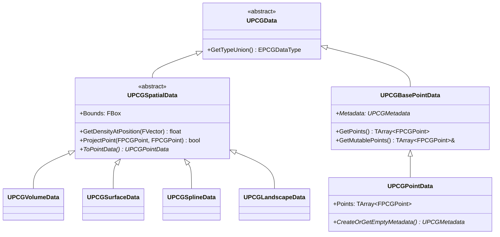

# FPCGPoint・PointData・SpatialData・Metadata

- 上位: [[PCG/01_overview]]
- ソース: `Engine/Plugins/PCG/Source/PCG/Public/PCGPoint.h`
          `Engine/Plugins/PCG/Source/PCG/Public/Data/PCGPointData.h`
          `Engine/Plugins/PCG/Source/PCG/Public/Data/PCGSpatialData.h`

---

## 概要

PCG のデータモデルは **データ型の階層**で構成される。`UPCGData` を基底とし、空間データ（`UPCGSpatialData`）とポイントデータ（`UPCGPointData`）が主要な型。各ポイントは `FPCGPoint` 構造体で表現される。

---

## データ型の階層



---

## FPCGPoint — ポイントの構造体

```cpp
USTRUCT(BlueprintType)
struct FPCGPoint
{
    // ワールド空間でのトランスフォーム（位置・回転・スケール）
    UPROPERTY(BlueprintReadWrite, EditAnywhere, Category = Properties)
    FTransform Transform;

    // サンプリング密度。0〜1 の値。フィルタリングや重み付けに使用
    UPROPERTY(BlueprintReadWrite, EditAnywhere, Category = Properties)
    float Density = 1.0f;

    // ローカル空間でのバウンド（最小）
    UPROPERTY(BlueprintReadWrite, EditAnywhere, Category = Properties)
    FVector BoundsMin = -FVector::One();

    // ローカル空間でのバウンド（最大）
    UPROPERTY(BlueprintReadWrite, EditAnywhere, Category = Properties)
    FVector BoundsMax = FVector::One();

    // RGBA カラー（属性として使用可能）
    UPROPERTY(BlueprintReadWrite, EditAnywhere, Category = Properties)
    FVector4 Color = FVector4::One();

    // 密度ボリュームの硬さ。0=ソフト、1=ハード（バイナリボックス）
    UPROPERTY(BlueprintReadWrite, EditAnywhere, Category = Properties, meta=(ClampMin="0", ClampMax="1"))
    float Steepness = 0.5f;

    // ランダムシード（各ポイントごとに一意）
    UPROPERTY(BlueprintReadWrite, EditAnywhere, Category = Properties)
    int32 Seed = 0;

    // メタデータエントリインデックス（UPCGMetadata の行番号）
    UPROPERTY(BlueprintReadOnly, VisibleAnywhere, Category = "Properties|Metadata")
    int64 MetadataEntry = -1;

    // ヘルパーメソッド
    FBox GetLocalBounds() const;           // ローカルバウンド取得
    FBox GetLocalDensityBounds() const;    // 密度ボリュームのバウンド
    void SetLocalBounds(const FBox& InBounds);
};
```

---

## EPCGPointProperties — ポイントプロパティ列挙

ノード設定でアクセスするポイントのプロパティを指定する際に使用。

| プロパティ | 説明 |
|-----------|------|
| `Density` | 密度値（0–1）。フィルタ・重み付けに使用 |
| `BoundsMin` / `BoundsMax` | ローカルバウンドの最小・最大 |
| `Extents` | バウンドの半径ベクトル |
| `Color` | RGBA カラー値 |
| `Position` | Transform の位置成分 |
| `Rotation` | Transform の回転成分 |
| `Scale` | Transform のスケール成分 |
| `Transform` | 完全なトランスフォーム |
| `Steepness` | 密度ボリュームの硬さ |
| `Seed` | ランダムシード |
| `LocalSize` | ローカルバウンドのサイズ (Max-Min) |

---

## UPCGPointData — ポイントデータコンテナ

```cpp
UCLASS(MinimalAPI, BlueprintType, ClassGroup = (Procedural))
class UPCGPointData : public UPCGBasePointData
{
    // ポイントの配列（中心的なデータ）
    TArray<FPCGPoint> Points;

    // メタデータ（カスタム属性テーブル）
    UPROPERTY()
    TObjectPtr<UPCGMetadata> Metadata;

public:
    // ポイントアクセス
    const TArray<FPCGPoint>& GetPoints() const;
    TArray<FPCGPoint>& GetMutablePoints();

    // メタデータ
    UPCGMetadata* CreateOrGetEmptyMetadata();
    void SetPoints(const TArray<FPCGPoint>& InPoints);
    int32 GetNum() const override { return Points.Num(); }
};
```

---

## UPCGSpatialData — 空間データ基底

サンプリング可能な空間表現の基底クラス。サンプラーノードはこの型を入力として受け取る。

```cpp
UCLASS(Abstract, MinimalAPI, BlueprintType, ClassGroup = (Procedural))
class UPCGSpatialData : public UPCGData
{
    // データのバウンド
    FBox Bounds;

    // 指定位置の密度を計算（0–1）
    virtual float GetDensityAtPosition(const FVector& InPosition) const PURE_VIRTUAL(...);

    // ポイントを空間データに投影（例：地形の高さに合わせる）
    virtual bool ProjectPoint(const FPCGPoint& InPoint, const FProjectionParams& InParams,
                               FPCGPoint& OutPoint) const;

    // PointData に変換（サンプリング）
    virtual UPCGPointData* ToPointData(FPCGContext* Context, const FBox& InBounds = FBox(EForceInit::ForceInit)) const;
};
```

### 主な派生クラス

| クラス | 説明 |
|-------|------|
| `UPCGVolumeData` | ボックスボリューム（入力範囲指定） |
| `UPCGSurfaceData` | メッシュ表面 |
| `UPCGSplineData` | スプラインコンポーネント |
| `UPCGLandscapeData` | ランドスケープ（高さ・法線・テクスチャ） |

---

## UPCGMetadata — カスタム属性テーブル

PCG の属性システム。ポイントに任意の型の属性（float・int・bool・FVector 等）を付与できる。

```cpp
UCLASS(MinimalAPI, BlueprintType, ClassGroup = (Procedural))
class UPCGMetadata : public UObject
{
public:
    // 属性の作成
    FPCGMetadataAttributeBase* CreateAttribute(FName AttributeName, const UPCGMetadata* InParent,
                                                bool bAllowsInterpolation, bool bOverrideParent);

    // 属性の取得
    FPCGMetadataAttributeBase* GetMutableAttribute(FName AttributeName);
    const FPCGMetadataAttributeBase* GetConstAttribute(FName AttributeName) const;

    // エントリの追加（ポイントとの対応付け）
    int64 AddEntry(int64 ParentEntryKey = -1);
};
```

### 型付き属性アクセス

```cpp
// float 型の属性を作成
FPCGMetadataAttribute<float>* Attr = Metadata->CreateAttribute<float>(
    TEXT("MyFloat"), nullptr, /*bAllowInterp=*/true, /*bOverrideParent=*/true);

// 値の設定
Attr->SetValue(Point.MetadataEntry, 0.75f);

// 値の取得
float Value = Attr->GetValueFromItemKey(Point.MetadataEntry);
```

---

## FPCGContext — 実行コンテキスト

各ノードの `Execute()` に渡される実行コンテキスト。

```cpp
struct FPCGContext
{
    UPCGComponent* SourceComponent;    // 実行元 UPCGComponent
    const UPCGNode* Node;              // 現在のノード
    FRandomStream RandomStream;        // 再現性のある乱数ストリーム
    FPCGInputOutputSettings InputOutput; // 入出力データ

    // 入力データの取得
    TArray<FPCGTaggedData> InputData;

    // 出力データへの追加
    TArray<FPCGTaggedData> OutputData;
};
```
