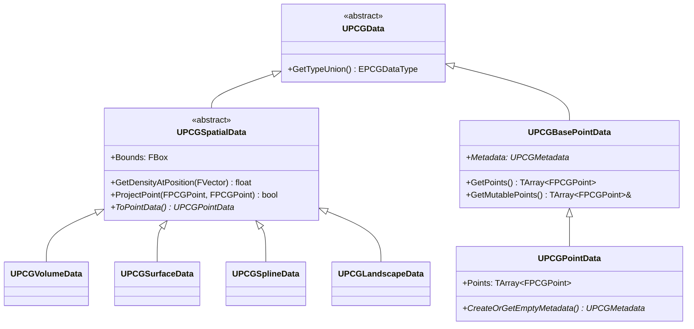

# FPCGPoint・PointData・SpatialData・Metadata

- 上位: [[PCG/01_overview]]
- ソース: `Engine/Plugins/PCG/Source/PCG/Public/PCGPoint.h`
          `Engine/Plugins/PCG/Source/PCG/Public/Data/PCGPointData.h`
          `Engine/Plugins/PCG/Source/PCG/Public/Data/PCGSpatialData.h`

---

## 概要

PCG のデータモデルは **データ型の階層**で構成される。`UPCGData` を基底とし、空間データ（`UPCGSpatialData`）とポイントデータ（`UPCGPointData`）が主要な型。各ポイントは `FPCGPoint` 構造体で表現される。

---

## データ型の階層



---

## FPCGPoint — ポイントの構造体

```cpp
USTRUCT(BlueprintType)
struct FPCGPoint
{
    // ワールド空間でのトランスフォーム（位置・回転・スケール）
    UPROPERTY(BlueprintReadWrite, EditAnywhere, Category = Properties)
    FTransform Transform;

    // サンプリング密度。0〜1 の値。フィルタリングや重み付けに使用
    UPROPERTY(BlueprintReadWrite, EditAnywhere, Category = Properties)
    float Density = 1.0f;

    // ローカル空間でのバウンド（最小）
    UPROPERTY(BlueprintReadWrite, EditAnywhere, Category = Properties)
    FVector BoundsMin = -FVector::One();

    // ローカル空間でのバウンド（最大）
    UPROPERTY(BlueprintReadWrite, EditAnywhere, Category = Properties)
    FVector BoundsMax = FVector::One();

    // RGBA カラー（属性として使用可能）
    UPROPERTY(BlueprintReadWrite, EditAnywhere, Category = Properties)
    FVector4 Color = FVector4::One();

    // 密度ボリュームの硬さ。0=ソフト、1=ハード（バイナリボックス）
    UPROPERTY(BlueprintReadWrite, EditAnywhere, Category = Properties, meta=(ClampMin="0", ClampMax="1"))
    float Steepness = 0.5f;

    // ランダムシード（各ポイントごとに一意）
    UPROPERTY(BlueprintReadWrite, EditAnywhere, Category = Properties)
    int32 Seed = 0;

    // メタデータエントリインデックス（UPCGMetadata の行番号）
    UPROPERTY(BlueprintReadOnly, VisibleAnywhere, Category = "Properties|Metadata")
    int64 MetadataEntry = -1;

    // ヘルパーメソッド
    FBox GetLocalBounds() const;           // ローカルバウンド取得
    FBox GetLocalDensityBounds() const;    // 密度ボリュームのバウンド
    void SetLocalBounds(const FBox& InBounds);
};
```

---

## EPCGPointProperties — ポイントプロパティ列挙

ノード設定でアクセスするポイントのプロパティを指定する際に使用。

| プロパティ | 説明 |
|-----------|------|
| `Density` | 密度値（0–1）。フィルタ・重み付けに使用 |
| `BoundsMin` / `BoundsMax` | ローカルバウンドの最小・最大 |
| `Extents` | バウンドの半径ベクトル |
| `Color` | RGBA カラー値 |
| `Position` | Transform の位置成分 |
| `Rotation` | Transform の回転成分 |
| `Scale` | Transform のスケール成分 |
| `Transform` | 完全なトランスフォーム |
| `Steepness` | 密度ボリュームの硬さ |
| `Seed` | ランダムシード |
| `LocalSize` | ローカルバウンドのサイズ (Max-Min) |

---

## UPCGPointData — ポイントデータコンテナ

```cpp
UCLASS(MinimalAPI, BlueprintType, ClassGroup = (Procedural))
class UPCGPointData : public UPCGBasePointData
{
    // ポイントの配列（中心的なデータ）
    TArray<FPCGPoint> Points;

    // メタデータ（カスタム属性テーブル）
    UPROPERTY()
    TObjectPtr<UPCGMetadata> Metadata;

public:
    // ポイントアクセス
    const TArray<FPCGPoint>& GetPoints() const;
    TArray<FPCGPoint>& GetMutablePoints();

    // メタデータ
    UPCGMetadata* CreateOrGetEmptyMetadata();
    void SetPoints(const TArray<FPCGPoint>& InPoints);
    int32 GetNum() const override { return Points.Num(); }
};
```

---

## UPCGSpatialData — 空間データ基底

サンプリング可能な空間表現の基底クラス。サンプラーノードはこの型を入力として受け取る。

```cpp
UCLASS(Abstract, MinimalAPI, BlueprintType, ClassGroup = (Procedural))
class UPCGSpatialData : public UPCGData
{
    // データのバウンド
    FBox Bounds;

    // 指定位置の密度を計算（0–1）
    virtual float GetDensityAtPosition(const FVector& InPosition) const PURE_VIRTUAL(...);

    // ポイントを空間データに投影（例：地形の高さに合わせる）
    virtual bool ProjectPoint(const FPCGPoint& InPoint, const FProjectionParams& InParams,
                               FPCGPoint& OutPoint) const;

    // PointData に変換（サンプリング）
    virtual UPCGPointData* ToPointData(FPCGContext* Context, const FBox& InBounds = FBox(EForceInit::ForceInit)) const;
};
```

### 主な派生クラス

| クラス | 説明 |
|-------|------|
| `UPCGVolumeData` | ボックスボリューム（入力範囲指定） |
| `UPCGSurfaceData` | メッシュ表面 |
| `UPCGSplineData` | スプラインコンポーネント |
| `UPCGLandscapeData` | ランドスケープ（高さ・法線・テクスチャ） |

---

## UPCGMetadata — カスタム属性テーブル

PCG の属性システム。ポイントに任意の型の属性（float・int・bool・FVector 等）を付与できる。

```cpp
UCLASS(MinimalAPI, BlueprintType, ClassGroup = (Procedural))
class UPCGMetadata : public UObject
{
public:
    // 属性の作成
    FPCGMetadataAttributeBase* CreateAttribute(FName AttributeName, const UPCGMetadata* InParent,
                                                bool bAllowsInterpolation, bool bOverrideParent);

    // 属性の取得
    FPCGMetadataAttributeBase* GetMutableAttribute(FName AttributeName);
    const FPCGMetadataAttributeBase* GetConstAttribute(FName AttributeName) const;

    // エントリの追加（ポイントとの対応付け）
    int64 AddEntry(int64 ParentEntryKey = -1);
};
```

### 型付き属性アクセス

```cpp
// float 型の属性を作成
FPCGMetadataAttribute<float>* Attr = Metadata->CreateAttribute<float>(
    TEXT("MyFloat"), nullptr, /*bAllowInterp=*/true, /*bOverrideParent=*/true);

// 値の設定
Attr->SetValue(Point.MetadataEntry, 0.75f);

// 値の取得
float Value = Attr->GetValueFromItemKey(Point.MetadataEntry);
```

---

## FPCGContext — 実行コンテキスト

各ノードの `Execute()` に渡される実行コンテキスト。

```cpp
struct FPCGContext
{
    UPCGComponent* SourceComponent;    // 実行元 UPCGComponent
    const UPCGNode* Node;              // 現在のノード
    FRandomStream RandomStream;        // 再現性のある乱数ストリーム
    FPCGInputOutputSettings InputOutput; // 入出力データ

    // 入力データの取得
    TArray<FPCGTaggedData> InputData;

    // 出力データへの追加
    TArray<FPCGTaggedData> OutputData;
};
```

---

## コード実行フロー

### エントリポイント

```
[PointData 生成 — Sampler ノード内]
UPCGSurfaceSamplerElement::ExecuteInternal(Context)
  └─ UPCGPointData* OutData = FPCGContext::NewObject_AnyThread<UPCGPointData>()
       ├─ UPCGMetadata* Metadata = OutData->CreateOrGetEmptyMetadata()
       │    └─ Parent Metadata（入力から継承）を設定
       │    └─ CreateAttribute<float>("Density") などを登録
       ├─ for each サンプリング位置:
       │    ├─ FPCGPoint Point
       │    ├─ Point.Transform = FTransform(Location)
       │    ├─ Point.Density = Surface->GetDensityAtPosition(Location)
       │    ├─ Point.Seed = ComputeSeed(Context->GetSeed(), Index)
       │    ├─ Point.MetadataEntry = Metadata->AddEntry()
       │    │    └─ ParentEntryKey 経由で継承エントリにリンク
       │    └─ OutData->GetMutablePoints().Add(Point)
       └─ Context->OutputData.Add(FPCGTaggedData{OutData, PinName, Tags})

[SpatialData → PointData 変換]
UPCGSpatialData::ToPointData(Context, Bounds)
  └─ 派生クラスで具体実装:
       ├─ UPCGVolumeData → グリッドサンプリングしてポイント生成
       ├─ UPCGSurfaceData → 表面サンプリング
       └─ UPCGLandscapeData → 地形セル単位でサンプリング
  └─ 結果の UPCGPointData を返す（以降は PointData として処理）

[属性アクセス — Filter/Transform ノード内]
FPCGMetadataAttribute<T>* Attr = Metadata->GetMutableTypedAttribute<T>(Name)
  └─ Attr->GetValueFromItemKey(Point.MetadataEntry)
       ├─ MetadataEntry が -1 → デフォルト値返却
       └─ -1 以外 → 属性ストレージから T 値取得
  └─ 新しい値を書く場合:
       └─ NewEntry = Metadata->AddEntry(OldEntry)
            └─ Attr->SetValue(NewEntry, Value)
            └─ Point.MetadataEntry = NewEntry  ← コピーオンライト

[ProjectPoint — 地形投影]
UPCGLandscapeData::ProjectPoint(InPoint, Params, OutPoint)
  ├─ WorldPos = InPoint.Transform.GetLocation()
  ├─ Landscape->GetHeightAtLocation(WorldPos) → Z 値取得
  ├─ Normal = Landscape->GetNormalAtLocation(WorldPos)
  └─ OutPoint.Transform = FTransform(LookRot(Normal), WorldPos_WithZ)

[メッシュ配置 — Spawner ノード]
UPCGStaticMeshSpawnerElement::PostExecuteInternal(Context)
  └─ UPCGComponent::PostProcessGraph():
       └─ for each ポイントグループ:
            └─ UInstancedStaticMeshComponent::AddInstance(Transform)
                 └─ CustomData 配列に属性値を書き込み
```

### フロー詳細

1. **データイミュータブル性** — PCG の全 `UPCGData` は読み取り専用で扱う。変更が必要なら `NewObject<>` で新インスタンスを作成しコピーする。これによりキャッシュ層が安全に結果を再利用可能（[[a_pcg_graph]]）。
2. **FPCGPoint の自己完結性** — ポイントは Transform/Density/Bounds/Color/Seed/MetadataEntry を持つ完全な単位。Metadata 以外はすべて POD で並列処理に適する。
3. **Metadata のエントリキー** — `FPCGPoint::MetadataEntry` は `UPCGMetadata` の行インデックス。`-1` は「エントリなし」でデフォルト値が使われる。エントリは継承（`ParentEntryKey`）を持ち、親属性を継承しつつ差分だけを記録可能。
4. **属性のコピーオンライト** — 既存ポイントの属性を変更するときは `AddEntry(OldEntryKey)` で新エントリを作成し、変更点だけ `SetValue` する。元データを改変しないためソース `UPCGPointData` は再利用可能。
5. **型付き属性** — `FPCGMetadataAttribute<T>` は `float`/`int32`/`FVector`/`FString` 等をサポート。非対応型を指定するとコンパイル時エラー。BP から使う場合は `FPCGMetadataAttributeBase` 経由でジェネリックアクセス。
6. **Spatial→Point 変換** — `UPCGSpatialData::ToPointData()` は派生クラスごとに実装。`UPCGVolumeData` はランダムボリュームサンプリング、`UPCGSurfaceData` は表面、`UPCGLandscapeData` は地形の `LandscapeInfo` からセル単位でサンプル。
7. **ProjectPoint** — ポイントを空間データに投影する API。地形サンプラーは `UPCGLandscapeData::ProjectPoint` で Z 値を合わせる。法線に沿って回転も変更可能（`FProjectionParams::bProjectRotations`）。
8. **FPCGTaggedData** — `Context->InputData` / `OutputData` の要素。`Data`（`UPCGData*`）+ `Pin`（ピン名）+ `Tags`（`TSet<FString>`）を持ち、タグでフィルタリング可能。
9. **スレッド安全性** — `UPCGData` 生成は `FPCGContext::NewObject_AnyThread` 経由で行い、ゲームスレッド以外からも安全に UObject を作成。`UPCGMetadata::AddEntry` は内部でアトミック操作を使用。
10. **メモリ管理** — グラフ実行後、出力されなかった中間 `UPCGData` は GC で解放される。キャッシュ済みデータは `UPCGSubsystem::GraphCache` から強参照され、明示的に `FlushCache` しない限り保持される。

### 関与クラス・関数一覧

| クラス / 関数 | ファイル | 役割 |
|-------------|---------|------|
| `FPCGPoint` | `PCGPoint.h` | ポイントデータ単位 |
| `UPCGPointData::GetMutablePoints` | `Data/PCGPointData.cpp` | 可変ポイント配列 |
| `UPCGSpatialData::ToPointData` | `Data/PCGSpatialData.cpp` | サンプリング変換 |
| `UPCGSpatialData::ProjectPoint` | `Data/PCGSpatialData.cpp` | 空間投影 |
| `UPCGMetadata::CreateAttribute` | `Metadata/PCGMetadata.cpp` | 属性定義 |
| `UPCGMetadata::AddEntry` | `Metadata/PCGMetadata.cpp` | エントリ追加 |
| `FPCGMetadataAttribute<T>::SetValue/GetValue` | `Metadata/PCGMetadataAttribute.h` | 型付きアクセス |
| `FPCGContext::NewObject_AnyThread` | `PCGContext.cpp` | スレッド安全オブジェクト生成 |
| `FPCGTaggedData` | `PCGData.h` | 入出力パイプ要素 |
