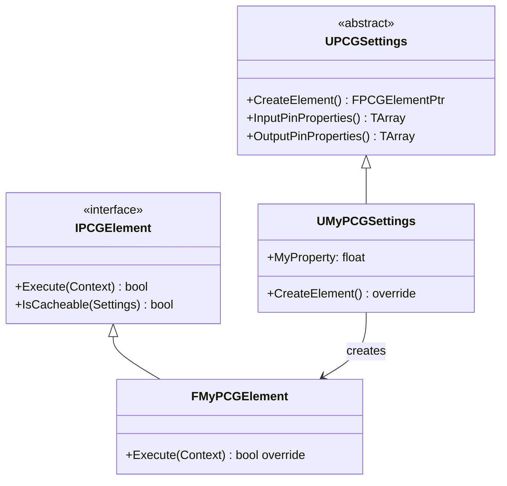

# カスタム PCG ノード実装・C++/BP 拡張

- 上位: [[PCG/01_overview]]
- ソース: `Engine/Plugins/PCG/Source/PCG/Public/Elements/Blueprint/PCGBlueprintBaseElement.h`
          `Engine/Plugins/PCG/Source/PCG/Public/PCGElement.h`
          `Engine/Plugins/PCG/Source/PCG/Public/PCGSettings.h`

---

## 概要

PCG カスタムノードは C++ と Blueprint の 2 通りで実装できる。Blueprint は `UPCGBlueprintBaseElement` を継承するだけで作成でき、プロトタイピングに適している。C++ は `UPCGSettings` + `IPCGElement` を実装する形で、より高いパフォーマンスが得られる。

---

## Blueprint カスタムノード

### UPCGBlueprintBaseElement の概要

```cpp
UCLASS(Abstract, BlueprintType, Blueprintable)
class UPCGBlueprintBaseElement : public UObject
{
    // 実行関数（BP でオーバーライド）
    UFUNCTION(BlueprintNativeEvent, BlueprintCallable, Category = "PCG|Execution")
    void Execute(const FPCGDataCollection& Input, FPCGDataCollection& Output);

    // ノード名のオーバーライド（BP でオーバーライド可）
    UFUNCTION(BlueprintNativeEvent, Category = "PCG|Node Customization")
    FName NodeTitleOverride() const;

    // ノードカラーのオーバーライド
    UFUNCTION(BlueprintNativeEvent, Category = "PCG|Node Customization")
    FLinearColor NodeColorOverride() const;

    // ノードタイプのオーバーライド
    UFUNCTION(BlueprintNativeEvent, Category = "PCG|Node Customization")
    EPCGSettingsType NodeTypeOverride() const;

    // キャッシュ可能かどうかのオーバーライド
    UFUNCTION(BlueprintNativeEvent, Category = "PCG|Execution")
    bool IsCacheableOverride() const;

    // ピン情報の取得
    UFUNCTION(BlueprintCallable, Category = "PCG|Input & Output")
    TArray<FPCGPinProperties> GetInputPins() const;

    UFUNCTION(BlueprintCallable, Category = "PCG|Input & Output")
    TArray<FPCGPinProperties> GetOutputPins() const;
};
```

### BP ノード作成手順

1. Content Browser → 右クリック → **Blueprint Class**
2. **PCGBlueprintElement**（または `UPCGBlueprintBaseElement` 派生）を親クラスに選択
3. `Execute` 関数をオーバーライド

```
[Execute]
Input  → (FPCGDataCollection)
Output → (FPCGDataCollection)

↓ ノードのロジック ↓

GetInputData (by pin label)
  → Loop over Points
    → CustomLogic (密度計算・位置変更 etc.)
  → SetOutputData (by pin label)
```

---

## C++ カスタムノード

### 実装構成

C++ カスタムノードは **設定クラス**（`UPCGSettings` 派生）と**実行クラス**（`IPCGElement` 実装）の 2 つで構成される。



### 設定クラスの実装

```cpp
UCLASS(BlueprintType, ClassGroup = (Procedural))
class MYGAME_API UMyPCGSettings : public UPCGSettings
{
    GENERATED_BODY()

public:
#if WITH_EDITOR
    // ノード名
    virtual FName GetDefaultNodeName() const override
    {
        return FName(TEXT("MyCustomNode"));
    }

    // ノードタイプ
    virtual EPCGSettingsType GetType() const override
    {
        return EPCGSettingsType::Filter;
    }
#endif

    // シードを使用するか
    virtual bool UseSeed() const override { return true; }

    // 入力ピン定義
    virtual TArray<FPCGPinProperties> InputPinProperties() const override;

    // 出力ピン定義
    virtual TArray<FPCGPinProperties> OutputPinProperties() const override;

    // 実行要素の生成
    virtual FPCGElementPtr CreateElement() const override;

public:
    // カスタムプロパティ（エディタで設定可能）
    UPROPERTY(BlueprintReadWrite, EditAnywhere, Category = Settings)
    float DensityThreshold = 0.5f;
};
```

### 実行クラスの実装

```cpp
class FMyPCGElement : public IPCGElement
{
public:
    // キャッシュ可能か
    virtual bool IsCacheable(const UPCGSettings* InSettings) const override
    {
        return true; // 同一入力・設定なら結果を再利用
    }

protected:
    // 実際の処理（非同期タスクグラフで実行される）
    virtual bool ExecuteInternal(FPCGContext* Context) const override
    {
        TRACE_CPUPROFILER_EVENT_SCOPE(FMyPCGElement::Execute);

        const UMyPCGSettings* Settings = Context->GetInputSettings<UMyPCGSettings>();
        check(Settings);

        // 入力データを取得
        TArray<FPCGTaggedData> Inputs = Context->InputData.GetInputsByPin(PCGPinConstants::DefaultInputLabel);

        for (const FPCGTaggedData& Input : Inputs)
        {
            const UPCGPointData* PointData = Cast<UPCGPointData>(Input.Data);
            if (!PointData) continue;

            // 出力ポイントデータを作成
            UPCGPointData* OutputData = NewObject<UPCGPointData>();
            OutputData->InitializeFromData(PointData);

            // ポイントのフィルタリング
            for (const FPCGPoint& Point : PointData->GetPoints())
            {
                if (Point.Density >= Settings->DensityThreshold)
                {
                    OutputData->GetMutablePoints().Add(Point);
                }
            }

            // 出力に追加
            FPCGTaggedData& OutputTaggedData = Context->OutputData.TaggedData.Add_GetRef(Input);
            OutputTaggedData.Data = OutputData;
        }

        return true;
    }
};

// Settings 側で CreateElement() を実装
FPCGElementPtr UMyPCGSettings::CreateElement() const
{
    return MakeShared<FMyPCGElement>();
}
```

---

## FPCGDataCollection — 入出力データコレクション

```cpp
struct FPCGDataCollection
{
    // タグ付きデータのリスト
    TArray<FPCGTaggedData> TaggedData;

    // ピン名でフィルタして取得
    TArray<FPCGTaggedData> GetInputsByPin(FName InPinLabel) const;

    // タグでフィルタして取得
    TArray<FPCGTaggedData> GetInputsByTag(FName InTag) const;

    // 全データを取得
    TArray<FPCGTaggedData> GetAllSettings() const;
};

struct FPCGTaggedData
{
    TObjectPtr<const UPCGData> Data;  // 実データ
    TSet<FName> Tags;                 // タグ（ラベル）
    FName Pin;                        // ピン名
    bool bIsParamData;                // パラメーターデータか
};
```

---

## ピンプロパティの定義

```cpp
TArray<FPCGPinProperties> UMyPCGSettings::InputPinProperties() const
{
    TArray<FPCGPinProperties> PinProperties;
    PinProperties.Emplace(
        PCGPinConstants::DefaultInputLabel,  // ピン名
        EPCGDataType::Point,                 // データ型
        /*bAllowMultipleConnections=*/true,  // 複数接続
        /*bAllowMultipleData=*/true          // 複数データ
    );
    return PinProperties;
}
```

### EPCGDataType

```cpp
enum class EPCGDataType : uint32
{
    None        = 0,
    Point       = 1 << 1,  // ポイントクラウド
    Spatial     = 1 << 2,  // 空間データ（Volume / Surface / Spline 等）
    Param       = 1 << 3,  // パラメーター
    Settings    = 1 << 4,  // 設定データ
    Any         = ~0u,
};
```

---

## コード実行フロー

### エントリポイント

```
[C++ カスタムノードの統合]
エンジン起動時
  └─ UClass 登録で UMyPCGSettings が UPCGSettings の派生として認識
       └─ PCG エディタのノード追加メニューに自動表示
            └─ GetDefaultNodeName() / GetType() / GetNodeTitleColor() を反映

[グラフ編集 — ノード追加]
UPCGGraph::AddNodeOfType(UMyPCGSettings::StaticClass())
  ├─ NewObject<UMyPCGSettings>() を生成
  ├─ Node->SettingsInterface = NewSettings
  └─ InputPinProperties() / OutputPinProperties() でピンを動的生成

[実行 — カスタム Element]
FPCGGraphExecutor::Execute() 内の該当タスク:
  └─ FPCGElementPtr = Settings->CreateElement()  ← MakeShared<FMyPCGElement>()
       └─ FMyPCGElement::Execute(Context):
            ├─ PrepareDataInternal(Context)    ← 入力検証（デフォルト）
            ├─ ExecuteInternal(Context):
            │    ├─ Settings = Context->GetInputSettings<UMyPCGSettings>()
            │    ├─ Inputs  = Context->InputData.GetInputsByPin(DefaultInputLabel)
            │    ├─ for each FPCGTaggedData:
            │    │    ├─ PointData = Cast<UPCGPointData>(Input.Data)
            │    │    ├─ OutputData = NewObject<UPCGPointData>()
            │    │    │    └─ InitializeFromData(PointData)  ← Metadata 引き継ぎ
            │    │    ├─ for each Point:
            │    │    │    └─ 条件判定 → OutputData->GetMutablePoints().Add(Point)
            │    │    └─ Context->OutputData.TaggedData.Add(OutputTaggedData)
            │    └─ return true
            └─ PostExecuteInternal(Context)    ← 出力整形

[キャッシュ判定]
FPCGGraphExecutor::Execute() 実行前:
  └─ if (Element->IsCacheable(Settings)):
       ├─ Key = FPCGDataCollection::ComputeCrc(Inputs) + Settings->GetCrc()
       ├─ if (GraphCache.Find(Key)):
       │    └─ CachedOutput を Context->OutputData に復元 → ExecuteInternal スキップ
       └─ else:
            └─ 通常実行 → 完了後にキャッシュに登録

[BP カスタムノード]
UPCGBlueprintBaseElement::Execute (BlueprintNativeEvent)
  └─ Blueprint 実装がある場合は BP 側の Execute を呼ぶ
       └─ UPCGBlueprintElement → Node の Input/Output を Kismet VM で処理
  └─ BP 側で GetInputData → ポイントループ → SetOutputData
```

### フロー詳細

1. **UClass 自動登録** — `GENERATED_BODY()` の効果で `UMyPCGSettings` は UObject システムに登録。PCG エディタはリフレクションで `UPCGSettings` 派生を列挙し、ノード追加メニューに表示する。特別な登録処理は不要。
2. **設定 vs 実行の分離** — `UPCGSettings`（UObject, シリアライズ可能）はエディタでの設定保持を担当。`IPCGElement`（純粋 C++、`TSharedPtr` 管理）は実行ロジックで状態を持たないためスレッド安全。
3. **CreateElement()** — `Settings->CreateElement()` は `MakeShared<FMyPCGElement>()` を返す。同じ Settings でも複数タスクが並列実行される場合、各タスクが同じ Element インスタンスを共有するためステートレス実装が必須。
4. **GetInputSettings** — `Context->GetInputSettings<T>()` で Settings をキャスト取得。これが正しい型でないと `check(Settings)` で停止するため、型安全のための標準パターン。
5. **InitializeFromData** — `UPCGPointData::InitializeFromData()` が Metadata テーブルを親データから継承。カスタム属性を保持したいとき必須の呼び出し（忘れると Metadata が null になる）。
6. **IsCacheable** — `true` を返すと同一入力+Settings で結果再利用される。乱数・外部状態に依存する処理は `false` にする必要がある（キャッシュで古い結果が返ってしまう）。
7. **FPCGDataCollection** — 入出力は `TArray<FPCGTaggedData>`。`GetInputsByPin()` でピン名、`GetInputsByTag()` でタグでフィルタ。タグ伝搬は `FPCGTaggedData` を `Add(Input)` で渡すと自動継承。
8. **ピン型指定** — `InputPinProperties()` で `EPCGDataType::Point` を指定すると、`UPCGSpatialData` 入力はコンパイラが `ToPointData()` を自動挿入。互換性のない型は UI でも接続不可。
9. **BP カスタムノード** — `UPCGBlueprintBaseElement` は `BlueprintNativeEvent` 経由。ネイティブ実装がデフォルトで、BP オーバーライドがあれば BP 側を優先。パフォーマンスは C++ 実装の 2〜3 倍遅い目安。
10. **TRACE マクロ** — `TRACE_CPUPROFILER_EVENT_SCOPE(FMyPCGElement::Execute)` で Unreal Insights のプロファイラに計測対象として登録。大規模グラフのボトルネック特定に必須。
11. **スレッド安全な UObject 生成** — `NewObject<UPCGPointData>()` は一見ゲームスレッド必須に見えるが、PCG は `FPCGContext::NewObject_AnyThread` 経由でワーカーからも安全に呼び出せる拡張を提供。

### 関与クラス・関数一覧

| クラス / 関数 | ファイル | 役割 |
|-------------|---------|------|
| `UPCGSettings::CreateElement` | `PCGSettings.cpp` | Element ファクトリ |
| `UPCGSettings::InputPinProperties` | `PCGSettings.cpp` | 入力ピン定義 |
| `IPCGElement::Execute` | `PCGElement.cpp` | 実行エントリ |
| `IPCGElement::ExecuteInternal` | 派生クラス | ノード固有処理 |
| `IPCGElement::IsCacheable` | `PCGElement.h` | キャッシュ判定 |
| `FPCGContext::GetInputSettings` | `PCGContext.cpp` | Settings キャスト取得 |
| `FPCGDataCollection::GetInputsByPin` | `PCGData.cpp` | 入力フィルタ |
| `UPCGPointData::InitializeFromData` | `Data/PCGPointData.cpp` | Metadata 継承 |
| `UPCGBlueprintBaseElement::Execute` | `Elements/Blueprint/PCGBlueprintBaseElement.cpp` | BP 実行統合 |
