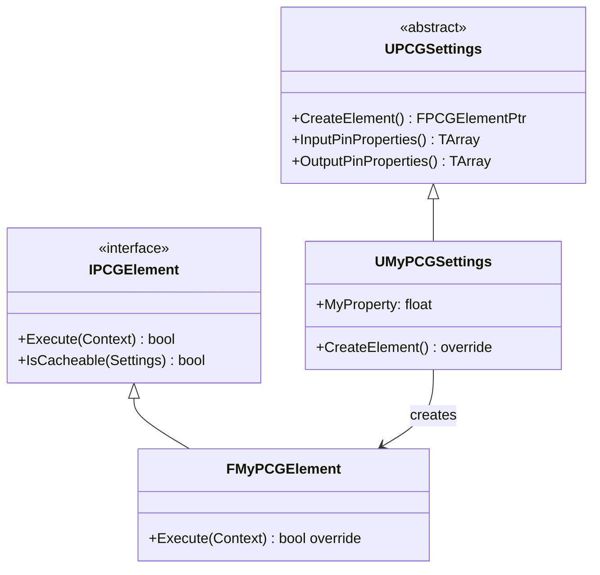

# カスタム PCG ノード実装・C++/BP 拡張

- 上位: [[PCG/01_overview]]
- ソース: `Engine/Plugins/PCG/Source/PCG/Public/Elements/Blueprint/PCGBlueprintBaseElement.h`
          `Engine/Plugins/PCG/Source/PCG/Public/PCGElement.h`
          `Engine/Plugins/PCG/Source/PCG/Public/PCGSettings.h`

---

## 概要

PCG カスタムノードは C++ と Blueprint の 2 通りで実装できる。Blueprint は `UPCGBlueprintBaseElement` を継承するだけで作成でき、プロトタイピングに適している。C++ は `UPCGSettings` + `IPCGElement` を実装する形で、より高いパフォーマンスが得られる。

---

## Blueprint カスタムノード

### UPCGBlueprintBaseElement の概要

```cpp
UCLASS(Abstract, BlueprintType, Blueprintable)
class UPCGBlueprintBaseElement : public UObject
{
    // 実行関数（BP でオーバーライド）
    UFUNCTION(BlueprintNativeEvent, BlueprintCallable, Category = "PCG|Execution")
    void Execute(const FPCGDataCollection& Input, FPCGDataCollection& Output);

    // ノード名のオーバーライド（BP でオーバーライド可）
    UFUNCTION(BlueprintNativeEvent, Category = "PCG|Node Customization")
    FName NodeTitleOverride() const;

    // ノードカラーのオーバーライド
    UFUNCTION(BlueprintNativeEvent, Category = "PCG|Node Customization")
    FLinearColor NodeColorOverride() const;

    // ノードタイプのオーバーライド
    UFUNCTION(BlueprintNativeEvent, Category = "PCG|Node Customization")
    EPCGSettingsType NodeTypeOverride() const;

    // キャッシュ可能かどうかのオーバーライド
    UFUNCTION(BlueprintNativeEvent, Category = "PCG|Execution")
    bool IsCacheableOverride() const;

    // ピン情報の取得
    UFUNCTION(BlueprintCallable, Category = "PCG|Input & Output")
    TArray<FPCGPinProperties> GetInputPins() const;

    UFUNCTION(BlueprintCallable, Category = "PCG|Input & Output")
    TArray<FPCGPinProperties> GetOutputPins() const;
};
```

### BP ノード作成手順

1. Content Browser → 右クリック → **Blueprint Class**
2. **PCGBlueprintElement**（または `UPCGBlueprintBaseElement` 派生）を親クラスに選択
3. `Execute` 関数をオーバーライド

```
[Execute]
Input  → (FPCGDataCollection)
Output → (FPCGDataCollection)

↓ ノードのロジック ↓

GetInputData (by pin label)
  → Loop over Points
    → CustomLogic (密度計算・位置変更 etc.)
  → SetOutputData (by pin label)
```

---

## C++ カスタムノード

### 実装構成

C++ カスタムノードは **設定クラス**（`UPCGSettings` 派生）と**実行クラス**（`IPCGElement` 実装）の 2 つで構成される。



### 設定クラスの実装

```cpp
UCLASS(BlueprintType, ClassGroup = (Procedural))
class MYGAME_API UMyPCGSettings : public UPCGSettings
{
    GENERATED_BODY()

public:
#if WITH_EDITOR
    // ノード名
    virtual FName GetDefaultNodeName() const override
    {
        return FName(TEXT("MyCustomNode"));
    }

    // ノードタイプ
    virtual EPCGSettingsType GetType() const override
    {
        return EPCGSettingsType::Filter;
    }
#endif

    // シードを使用するか
    virtual bool UseSeed() const override { return true; }

    // 入力ピン定義
    virtual TArray<FPCGPinProperties> InputPinProperties() const override;

    // 出力ピン定義
    virtual TArray<FPCGPinProperties> OutputPinProperties() const override;

    // 実行要素の生成
    virtual FPCGElementPtr CreateElement() const override;

public:
    // カスタムプロパティ（エディタで設定可能）
    UPROPERTY(BlueprintReadWrite, EditAnywhere, Category = Settings)
    float DensityThreshold = 0.5f;
};
```

### 実行クラスの実装

```cpp
class FMyPCGElement : public IPCGElement
{
public:
    // キャッシュ可能か
    virtual bool IsCacheable(const UPCGSettings* InSettings) const override
    {
        return true; // 同一入力・設定なら結果を再利用
    }

protected:
    // 実際の処理（非同期タスクグラフで実行される）
    virtual bool ExecuteInternal(FPCGContext* Context) const override
    {
        TRACE_CPUPROFILER_EVENT_SCOPE(FMyPCGElement::Execute);

        const UMyPCGSettings* Settings = Context->GetInputSettings<UMyPCGSettings>();
        check(Settings);

        // 入力データを取得
        TArray<FPCGTaggedData> Inputs = Context->InputData.GetInputsByPin(PCGPinConstants::DefaultInputLabel);

        for (const FPCGTaggedData& Input : Inputs)
        {
            const UPCGPointData* PointData = Cast<UPCGPointData>(Input.Data);
            if (!PointData) continue;

            // 出力ポイントデータを作成
            UPCGPointData* OutputData = NewObject<UPCGPointData>();
            OutputData->InitializeFromData(PointData);

            // ポイントのフィルタリング
            for (const FPCGPoint& Point : PointData->GetPoints())
            {
                if (Point.Density >= Settings->DensityThreshold)
                {
                    OutputData->GetMutablePoints().Add(Point);
                }
            }

            // 出力に追加
            FPCGTaggedData& OutputTaggedData = Context->OutputData.TaggedData.Add_GetRef(Input);
            OutputTaggedData.Data = OutputData;
        }

        return true;
    }
};

// Settings 側で CreateElement() を実装
FPCGElementPtr UMyPCGSettings::CreateElement() const
{
    return MakeShared<FMyPCGElement>();
}
```

---

## FPCGDataCollection — 入出力データコレクション

```cpp
struct FPCGDataCollection
{
    // タグ付きデータのリスト
    TArray<FPCGTaggedData> TaggedData;

    // ピン名でフィルタして取得
    TArray<FPCGTaggedData> GetInputsByPin(FName InPinLabel) const;

    // タグでフィルタして取得
    TArray<FPCGTaggedData> GetInputsByTag(FName InTag) const;

    // 全データを取得
    TArray<FPCGTaggedData> GetAllSettings() const;
};

struct FPCGTaggedData
{
    TObjectPtr<const UPCGData> Data;  // 実データ
    TSet<FName> Tags;                 // タグ（ラベル）
    FName Pin;                        // ピン名
    bool bIsParamData;                // パラメーターデータか
};
```

---

## ピンプロパティの定義

```cpp
TArray<FPCGPinProperties> UMyPCGSettings::InputPinProperties() const
{
    TArray<FPCGPinProperties> PinProperties;
    PinProperties.Emplace(
        PCGPinConstants::DefaultInputLabel,  // ピン名
        EPCGDataType::Point,                 // データ型
        /*bAllowMultipleConnections=*/true,  // 複数接続
        /*bAllowMultipleData=*/true          // 複数データ
    );
    return PinProperties;
}
```

### EPCGDataType

```cpp
enum class EPCGDataType : uint32
{
    None        = 0,
    Point       = 1 << 1,  // ポイントクラウド
    Spatial     = 1 << 2,  // 空間データ（Volume / Surface / Spline 等）
    Param       = 1 << 3,  // パラメーター
    Settings    = 1 << 4,  // 設定データ
    Any         = ~0u,
};
```
