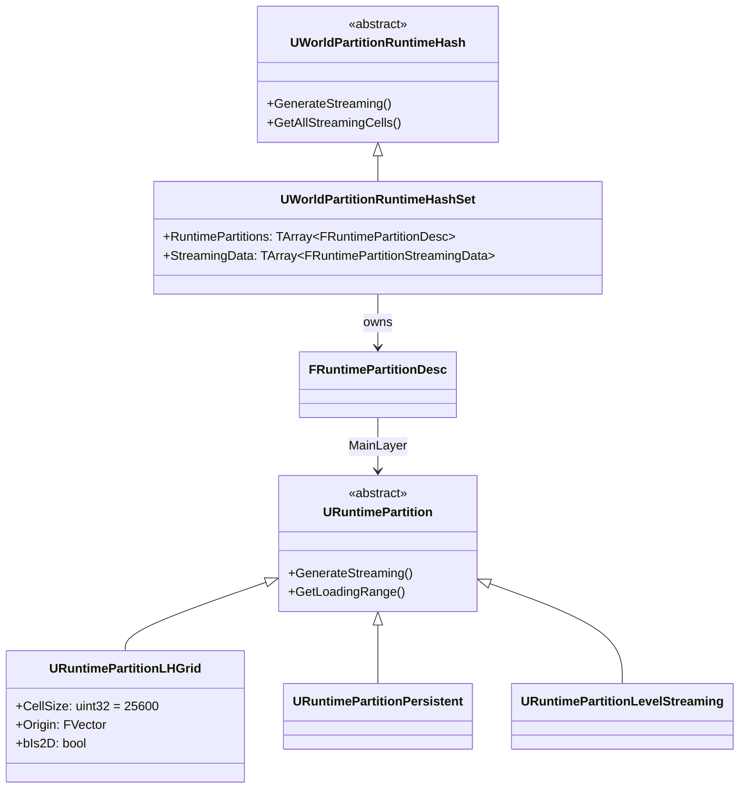
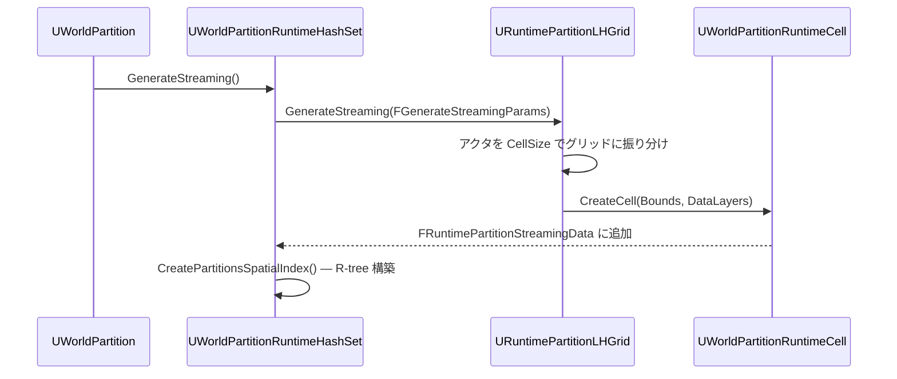

# WorldPartition 空間ハッシュ・グリッド設定

- 上位: [[WorldPartition/01_overview]]
- ソース: `Engine/Source/Runtime/Engine/Public/WorldPartition/RuntimeHashSet/`

---

## 概要

UE5.3 以降、World Partition のランタイムハッシュ実装は **UWorldPartitionRuntimeHashSet** が主流となった。旧来の `UWorldPartitionRuntimeSpatialHash`（レガシー）から置き換えられ、より柔軟なパーティション定義と HLOD 統合を実現する。

---

## クラス階層



---

## FRuntimePartitionDesc — パーティション設定

`UWorldPartitionRuntimeHashSet::RuntimePartitions` に格納される設定構造体。エディタの **World Settings → World Partition → Runtime Partitions** で編集する。

```cpp
USTRUCT()
struct FRuntimePartitionDesc
{
    // パーティション名（アクタの RuntimeGrid プロパティでマッピング）
    UPROPERTY(EditAnywhere, Category = RuntimeSettings)
    FName Name;

    // メインパーティション（実際のグリッド分割を担当）
    UPROPERTY(EditAnywhere, Category = RuntimeSettings, Instanced)
    TObjectPtr<URuntimePartition> MainLayer;

    // HLOD 設定（各 HLOD レイヤー用のパーティション）
    UPROPERTY(EditAnywhere, Category = RuntimeSettings)
    TArray<FRuntimePartitionHLODSetup> HLODSetups;
};
```

---

## URuntimePartitionLHGrid — LH グリッド

**Layered Hierarchical Grid**。最も一般的なパーティション実装で、ワールドを均一なセルに分割する。

### 主要プロパティ

| プロパティ | 型 | デフォルト | 説明 |
|-----------|-----|---------|------|
| `CellSize` | `uint32` | `25600` | セル辺長（cm）。256m 正方形が基準 |
| `Origin` | `FVector` | `(0,0,0)` | グリッド原点のオフセット |
| `bIs2D` | `bool` | `false` | 2D グリッド（Z 軸を無視してロード判定） |

### セルサイズの目安

| CellSize | 実寸 | 用途 |
|---------|------|------|
| `12800` | 128m | 密度が高い市街地・室内 |
| `25600` | 256m | 標準（Epic デフォルト） |
| `51200` | 512m | 広大な自然地形 |

---

## FRuntimePartitionStreamingData — ランタイム空間インデックス

クック後に生成され、実際のストリーミング判定に使用される。

```cpp
struct FRuntimePartitionStreamingData
{
    FName Name;                // パーティション名
    int32 LoadingRange;        // ロード距離（cm）

    // 空間的にロードされるセル群
    TArray<TObjectPtr<UWorldPartitionRuntimeCell>> SpatiallyLoadedCells;

    // 常時ロード（AlwaysLoaded）セル群
    TArray<TObjectPtr<UWorldPartitionRuntimeCell>> NonSpatiallyLoadedCells;

    // 実行時に構築される R-tree 空間インデックス
    mutable TUniquePtr<FStaticSpatialIndexType>   SpatialIndex;    // 3D
    mutable TUniquePtr<FStaticSpatialIndexType2D> SpatialIndex2D;  // 2D 投影
};
```

空間インデックスは **Hilbert ソート R-tree** (`TStaticSpatialIndexRTree`) で構築され、ストリーミングソースとの距離判定をO(log n) で行う。

---

## セル分割フロー（クック時）



---

## アクタのグリッド割り当て

各アクタは `AActor::RuntimeGrid` プロパティで所属パーティションを指定する。空文字（`NAME_None`）の場合はデフォルトグリッドに割り当てられる。

```cpp
// アクタのプロパティ（BP でも設定可）
UPROPERTY(EditAnywhere, Category = "World Partition")
FName RuntimeGrid;  // パーティション名を指定
```

---

## CVars

| CVar | デフォルト | 説明 |
|------|----------|------|
| `wp.Runtime.UpdateStreaming` | `1` | ストリーミング更新の有効/無効 |
| `wp.Runtime.EnableServerStreaming` | `0` | サーバー側ストリーミング |
| `wp.Editor.EnableStreaming` | `0` | エディタプレイ時のストリーミング |
