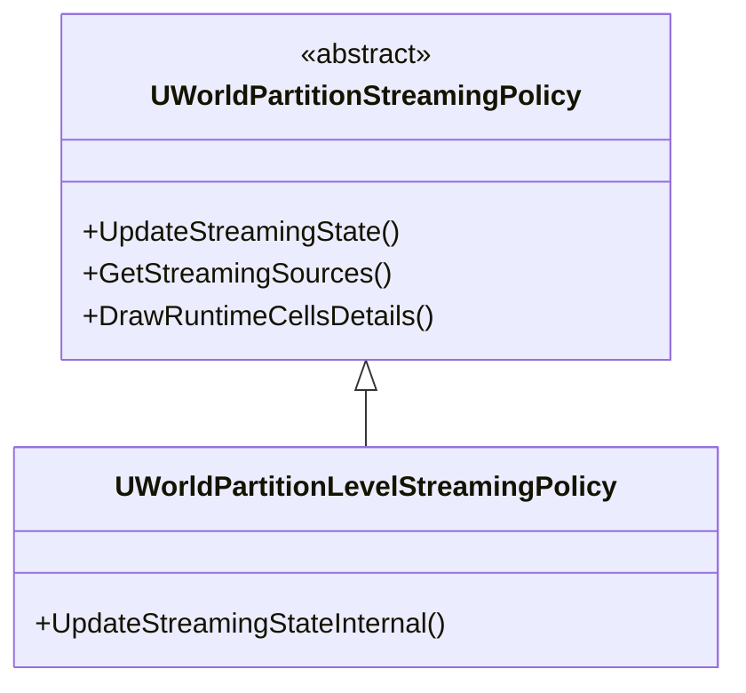
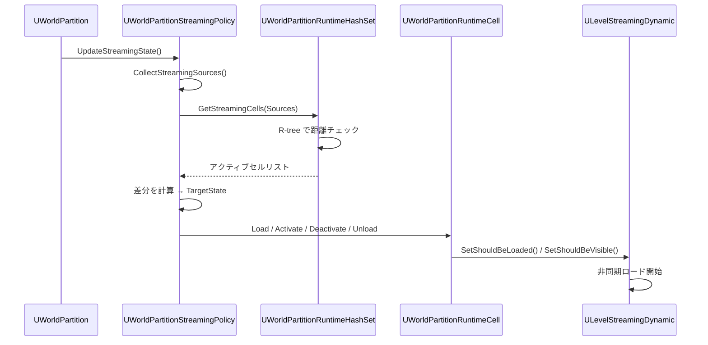

# WorldPartition ストリーミングポリシー・ソース

- 上位: [[WorldPartition/01_overview]]
- ソース: `Engine/Source/Runtime/Engine/Public/WorldPartition/WorldPartitionStreamingPolicy.h`
          `Engine/Source/Runtime/Engine/Public/WorldPartition/WorldPartitionStreamingSource.h`

---

## 概要

**ストリーミングポリシー**（`UWorldPartitionStreamingPolicy`）は、ストリーミングソースの位置情報を元にどのセルをロード/アンロードするかを決定する。毎フレーム `UpdateStreamingState()` が呼ばれ、セルの優先順位付けとロード要求を行う。

---

## クラス階層



実際には `UWorldPartitionLevelStreamingPolicy` が唯一の具体実装で、内部で `ULevelStreamingDynamic` を使ってセルを非同期ロードする。

---

## FWorldPartitionStreamingSource — ストリーミングソース

カメラや PlayerController などの「ストリーミング基準点」を表す構造体。

```cpp
struct FWorldPartitionStreamingSource
{
    FName Name;                          // ソース識別名
    FVector Location;                   // 基準位置
    FRotator Rotation;                  // 向き（セル優先順位に影響）
    EStreamingSourceTargetState TargetState; // Loaded / Activated
    bool bBlockOnSlowLoading;           // 遅いロードをブロックするか
    EStreamingSourcePriority Priority;  // ソース優先度
    FVector Velocity;                   // 速度（予測ロードに使用）
    TArray<FStreamingSourceShape> Shapes; // ソース形状（球・扇形等）
    EStreamingSourceTargetBehavior TargetBehavior; // Include / Exclude
    TSet<FName> TargetGrids;            // 対象グリッドのフィルタ
};
```

### TargetState の意味

| 状態 | 説明 |
|------|------|
| `Loaded` | セルをメモリにロード（非表示でも可） |
| `Activated` | セルをロードかつワールドに追加（表示） |

### SourcePriority

```cpp
enum class EStreamingSourcePriority : uint8
{
    Low = 0,
    Default = 128,
    High = 255
};
```

優先度が高いソースほどセルのロード順が早まる。

---

## FStreamingSourceShape — ソース形状

ストリーミング範囲を球だけでなく扇形（球面セクター）でも定義できる。

```cpp
USTRUCT(BlueprintType)
struct FStreamingSourceShape
{
    bool bUseGridLoadingRange;    // グリッドのデフォルト距離を使用
    float LoadingRangeScale;      // デフォルト距離へのスケール係数
    float Radius;                 // カスタム半径（bUseGridLoadingRange=false 時）
    bool bIsSector;               // 扇形を使用するか
    float SectorAngle;            // 扇形角度（0–360 度）
    FVector Location;             // ローカルオフセット
    FRotator Rotation;            // ローカル回転
};
```

**扇形ソース**は視錐台の方向に合わせたストリーミングに有効（前方優先ロード）。

---

## FWorldPartitionUpdateStreamingTargetState — ストリーミング目標状態

1フレームの更新で計算される、セルの遷移リスト。

```cpp
struct FWorldPartitionUpdateStreamingTargetState
{
    TArray<const UWorldPartitionRuntimeCell*> ToLoadCells;       // ロード開始
    TArray<const UWorldPartitionRuntimeCell*> ToActivateCells;   // Activate
    TArray<const UWorldPartitionRuntimeCell*> ToDeactivateCells; // Deactivate
    TArray<const UWorldPartitionRuntimeCell*> ToUnloadCells;     // アンロード
    EWorldPartitionStreamingPerformance StreamingPerformance;    // Good/Slow/Critical
    bool bBlockOnSlowStreaming;  // スロー時にブロック
};
```

---

## ストリーミング更新フロー



---

## ストリーミングソースの登録

### PlayerController（自動）

`APlayerController` は `IWorldPartitionStreamingSourceProvider` を実装しており、ゲーム開始時に自動的にソースとして登録される。

### UWorldPartitionStreamingSourceComponent（手動）

任意のアクタに付与して追加のストリーミングソースを定義できる。

```cpp
// BP でも追加可能
// コンポーネントのプロパティ
UPROPERTY(BlueprintReadWrite, EditAnywhere)
EStreamingSourceTargetState TargetState;   // Loaded / Activated

UPROPERTY(BlueprintReadWrite, EditAnywhere)
EStreamingSourcePriority Priority;

UPROPERTY(BlueprintReadWrite, EditAnywhere)
TArray<FStreamingSourceShape> Shapes;
```

---

## セルのロード状態遷移

```
Unloaded → Loading → Loaded → Activating → Activated
          ↑ SetShouldBeLoaded(true)         ↑ SetShouldBeVisible(true)

Activated → Deactivating → Deactivated → Unloading → Unloaded
          ↑ SetShouldBeVisible(false)   ↑ SetShouldBeLoaded(false)
```

---

## CVars

| CVar | 説明 |
|------|------|
| `wp.Runtime.UpdateStreaming` | ストリーミング更新を有効化（0 で停止） |
| `wp.Runtime.MaxCellsPerFrame` | 1 フレームあたり最大ロード開始セル数 |
| `wp.Runtime.DebugForcedCells` | デバッグ用強制ロードセル指定 |
| `wp.Runtime.OverrideLoadingRange` | ロード距離を上書き（デバッグ） |
