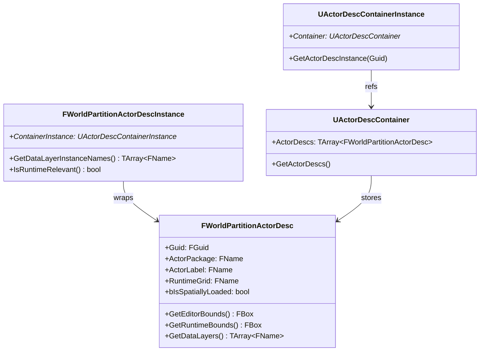
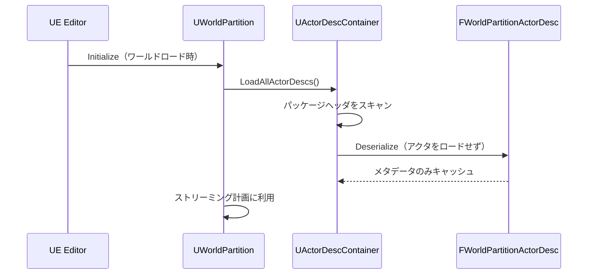

# WorldPartition ActorDesc・エディタ連携

- 上位: [[WorldPartition/01_overview]]
- ソース: `Engine/Source/Runtime/Engine/Public/WorldPartition/WorldPartitionActorDesc.h`
          `Engine/Source/Runtime/Engine/Public/WorldPartition/ActorDescContainerInstance.h`

---

## 概要

**ActorDesc（アクタ記述子）** は、アクタをメモリにロードせずにそのメタデータ（バウンド・DataLayer・クラス等）を参照するためのエディタ専用構造体。World Partition がオープンワールドのアクタを全ロードせずにストリーミング計画を立てられるのはこの仕組みのおかげ。

> `WITH_EDITOR` ガードで囲まれており、**ランタイムビルドには含まれない**。

---

## クラス構造



---

## FWorldPartitionActorDesc — 主要フィールド

| フィールド | 型 | 説明 |
|-----------|-----|------|
| `Guid` | `FGuid` | アクタの一意識別子 |
| `ActorPackage` | `FName` | アクタのパッケージ名（ディスク上） |
| `ActorLabel` | `FName` | エディタ表示名 |
| `RuntimeGrid` | `FName` | 所属パーティション名 |
| `bIsSpatiallyLoaded` | `bool` | 空間的にロードされるか |
| `bActorIsEditorOnly` | `bool` | エディタ専用アクタか |
| `HLODLayer` | `FSoftObjectPath` | 対応する HLOD レイヤー |
| `ActorTransform` | `FTransform` | ワールド変換 |

### 主要メソッド

```cpp
// バウンド取得
FBox GetEditorBounds() const;   // エディタ用（コリジョン含む）
FBox GetRuntimeBounds() const;  // ランタイム用（ストリーミング判定）

// DataLayer 取得（UE5.4 以降）
TArray<FName> GetDataLayers(bool bIncludeExternalDataLayer = true) const;

// メタデータ
FName GetRuntimeGrid() const;
bool GetIsSpatiallyLoaded() const;
bool GetActorIsHLODRelevant() const;
```

---

## ActorDesc の生成・シリアライズ

アクタが WP ワールドに保存されるとき、`AActor::CreateClassActorDesc()` がオーバーライドされて `FWorldPartitionActorDesc` が生成される。シリアライズされたデータはパッケージヘッダに埋め込まれ、エディタ起動時に全パッケージをスキャンして読み込まれる。



---

## FWorldPartitionActorDescInstance — ランタイム解決

`FWorldPartitionActorDesc` は純粋なデータ。`FWorldPartitionActorDescInstance` がコンテナインスタンスのコンテキストで実際のランタイム状態（DataLayerInstance 名前解決等）を付加する。

```cpp
class FWorldPartitionActorDescInstance
{
public:
    // DataLayerInstance 名の解決済みリスト（ランタイム）
    bool HasResolvedDataLayerInstanceNames() const;
    TArray<FName> GetDataLayerInstanceNames() const;

    // ランタイム関連性の判定
    bool IsRuntimeRelevant(const FActorContainerID& InContainerID) const;
    bool IsEditorRelevant() const;

    // コンテナ情報
    UActorDescContainerInstance* GetContainerInstance() const;
    const FTransform& GetContainerTransform() const;
};
```

---

## FWorldPartitionRelativeBounds — 相対バウンド

アクタの位置をコンテナの Transform からの相対座標で保持する。Level Instance（入れ子ワールド）での再利用に対応。

```cpp
struct FWorldPartitionRelativeBounds
{
    FVector Center;
    FQuat Rotation;
    FVector Extents;
    bool bIsValid;

    FBox ToAABB() const;  // AABB に変換
    FWorldPartitionRelativeBounds TransformBy(const FTransform&) const;
};
```

---

## アクタ側での登録

`AActor` にはいくつかの WP 関連プロパティがある（BP でも設定可）。

```cpp
// AActor のプロパティ
UPROPERTY(EditAnywhere, Category = "World Partition")
FName RuntimeGrid;           // 所属パーティション

UPROPERTY(EditAnywhere, Category = "World Partition")
bool bIsSpatiallyLoaded;     // 空間ロードか AlwaysLoaded か

UPROPERTY(EditAnywhere, Category = "World Partition")
bool bActorIsHLODRelevant;   // HLOD 生成に含めるか

UPROPERTY(EditAnywhere, Category = "World Partition")
TObjectPtr<UHLODLayer> HLODLayer; // 使用する HLOD レイヤー
```

---

## エディタでの利用

- **World Partition Editor**（Window → World Partition）でセル・アクタ分布を可視化
- **ミニマップ**は ActorDesc のバウンドを使ってアクタ位置をプレビュー
- クック時は ActorDesc からセル→アクタのマッピングを生成し、実際のパッケージ参照を解決する

---

## コード実行フロー

### エントリポイント

```
[マップ読み込み時]
UWorldPartition::Initialize()
  └─ UActorDescContainerSubsystem::RegisterContainer()
       └─ UActorDescContainerInstance::Initialize()
            └─ for each .uasset under __ExternalActors__/<MapName>/:
                 └─ FWorldPartitionActorDescUtils::GetActorDescriptorFromPackage()
                      ├─ パッケージヘッダのみ読み込み（アクタ本体はロードしない）
                      ├─ AActor::CreateClassActorDesc() で ActorDesc 生成
                      └─ ActorDesc->Init(Actor) で属性抽出
                           ├─ Bounds（バウンディングボックス）
                           ├─ DataLayers
                           ├─ Class / Tags / Guid
                           └─ HLODLayer 参照
            └─ ActorDescList に登録

[ストリーミング生成時]
UWorldPartitionRuntimeHashSet::GenerateStreaming()
  └─ for each FWorldPartitionActorDescInstance:
       └─ ActorDesc->GetEditorBounds() / GetRuntimeBounds()
            └─ セルへの割り当て計算（ロード不要）

[ランタイム — アクタ実体化]
ULevelStreamingDynamic::SetShouldBeLoaded(true)
  └─ LoadPackageAsync(ActorDesc->GetActorPackage())
       └─ AActor::PostLoad()
            └─ FWorldPartitionActorDesc を実アクタにアタッチ
```

### フロー詳細

1. **コンテナ初期化** — マップロード時に `UActorDescContainerInstance::Initialize()` が `__ExternalActors__/<MapName>/` 以下の全 `.uasset` を走査。
2. **ヘッダのみ読込** — `GetActorDescriptorFromPackage()` がパッケージヘッダ（`FAssetData` 相当）だけを読み込み、アクタクラス情報を取得。本体（コンポーネント・プロパティ）はロードしない。
3. **ActorDesc 生成** — `AActor::CreateClassActorDesc()` でクラス固有の ActorDesc（例: `FLandscapeActorDesc`、`FLevelInstanceActorDesc`）を生成。
4. **属性シリアライズ** — `ActorDesc->Init(Actor)` がバウンド・DataLayer・Tag 等を抽出し、専用シリアライザで保存。次回からは `Serialize()` で復元のみ。
5. **ストリーミング計算で利用** — `UWorldPartitionRuntimeHashSet::GenerateStreaming()` が ActorDesc のバウンドでセル割り当てを行う。実アクタを 1 つもロードせずにストリーミング計画を完成させられる。
6. **ランタイム実体化** — セルロード時にようやく `LoadPackageAsync()` で実アクタを読み込み。ActorDesc は実アクタにリンクされ、エディタ機能（ピン留め・フィルタ）から参照可能。
7. **WITH_EDITOR ガード** — ActorDesc 関連コードは `#if WITH_EDITOR` で囲まれ、クック後のランタイムビルドには含まれない。Cook 時に `UWorldPartitionCookPackageContext` がセル→パッケージのマッピングを焼き込む。

### 関与クラス・関数一覧

| クラス / 関数 | ファイル | 役割 |
|-------------|---------|------|
| `FWorldPartitionActorDesc` | `WorldPartitionActorDesc.h` | ActorDesc 基底 |
| `FWorldPartitionActorDescInstance` | `ActorDescContainerInstance.h` | コンテナ内インスタンス |
| `UActorDescContainerInstance::Initialize` | `ActorDescContainerInstance.cpp` | コンテナ初期化 |
| `UActorDescContainerSubsystem` | `ActorDescContainerSubsystem.cpp` | コンテナ管理 |
| `FWorldPartitionActorDescUtils::GetActorDescriptorFromPackage` | `WorldPartitionActorDescUtils.cpp` | パッケージヘッダから生成 |
| `AActor::CreateClassActorDesc` | `Actor.cpp` | クラス固有 Desc 生成 |
| `UWorldPartitionCookPackageContext` | `Cook/WorldPartitionCookPackageContext.cpp` | クック時パッケージ生成 |
