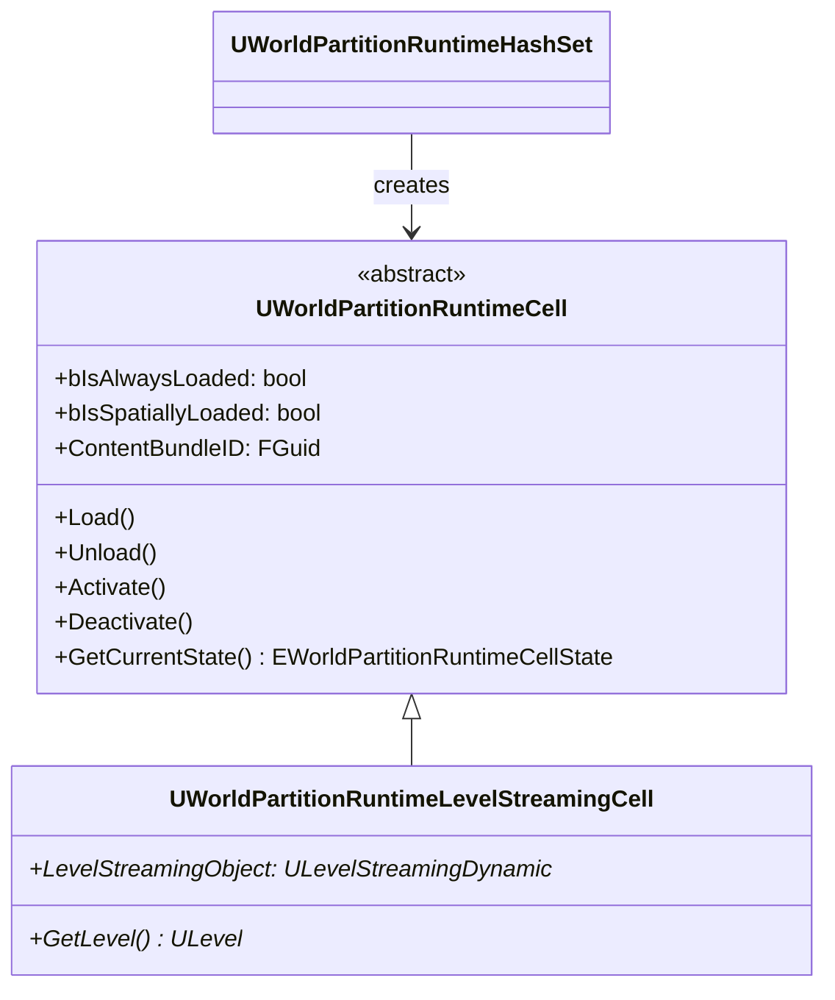
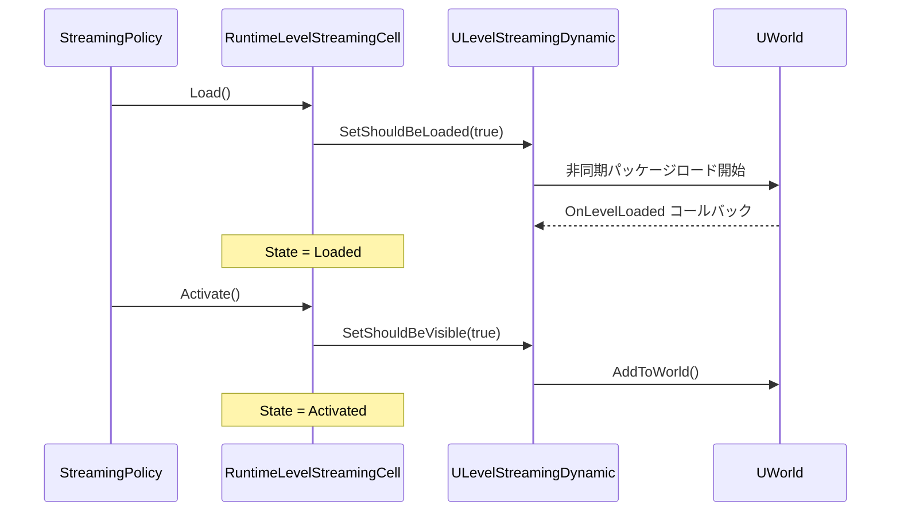

# WorldPartition RuntimeCell・ContentBundle

- 上位: [[WorldPartition/01_overview]]
- ソース: `Engine/Source/Runtime/Engine/Public/WorldPartition/WorldPartitionRuntimeCell.h`
          `Engine/Source/Runtime/Engine/Public/WorldPartition/ContentBundle/`

---

## 概要

**UWorldPartitionRuntimeCell** は World Partition のストリーミング単位。1 セルが 1 つの `ULevelStreaming` に対応し、Load/Activate/Deactivate/Unload の状態遷移を管理する。

---

## クラス階層



実際にゲームで使われるのは `UWorldPartitionRuntimeLevelStreamingCell`（`ULevelStreamingDynamic` を内包）。

---

## EWorldPartitionRuntimeCellState — セル状態

```cpp
UENUM(BlueprintType)
enum class EWorldPartitionRuntimeCellState : uint8
{
    Unloaded,   // ディスクから未ロード
    Loaded,     // メモリにロード済み（不可視）
    Activated   // ワールドに追加済み（可視）
};
```

---

## 主要プロパティ

| プロパティ | 型 | 説明 |
|-----------|-----|------|
| `bIsAlwaysLoaded` | `bool` | ストリーミングソースによらず常時ロード |
| `bIsSpatiallyLoaded` | `bool` | 空間的にロード（false = AlwaysLoaded） |
| `bClientOnlyVisible` | `bool` | クライアント専用の表示 |
| `bBlockOnSlowLoading` | `bool` | 遅いロード時にゲームスレッドをブロック |
| `ContentBundleID` | `FGuid` | ContentBundle との関連付け |
| `DataLayers` | `FDataLayerInstanceNames` | 所属 DataLayer リスト |

---

## 主要メソッド

```cpp
// 状態遷移（ストリーミングポリシーから呼び出される）
virtual void Load() const;      // ディスクからロード開始
virtual void Unload() const;    // メモリから解放
virtual void Activate() const;  // ワールドに追加（表示）
virtual void Deactivate() const;// ワールドから除去（非表示）

// 状態確認
virtual EWorldPartitionRuntimeCellState GetCurrentState() const;
virtual bool IsAlwaysLoaded() const;
virtual bool IsSpatiallyLoaded() const;

// DataLayer
TArray<const UDataLayerInstance*> GetDataLayerInstances() const;
bool ContainsDataLayer(const UDataLayerAsset* DataLayerAsset) const;
EDataLayerRuntimeState GetCellEffectiveWantedState(
    const FWorldPartitionStreamingContext& Context) const;

// ContentBundle
bool HasContentBundle() const;
const FGuid& GetContentBundleID() const;
```

---

## セルのロードフロー



---

## FWorldPartitionRuntimeCellDebugInfo — デバッグ情報

```cpp
struct FWorldPartitionRuntimeCellDebugInfo
{
    FString Name;    // セル名
    FName GridName;  // 所属グリッド名
    int64 CoordX;    // グリッド座標 X
    int64 CoordY;    // グリッド座標 Y
    int64 CoordZ;    // グリッド座標 Z（bIs2D=false 時）
};
```

デバッグ表示（`wp.Runtime.ToggleDrawRuntimeHash2D` 等）でセル座標が表示される。

---

## ContentBundle — コンテンツバンドル（UE5.3+）

**ContentBundle** は DLC・ライブサービスコンテンツなど、メインワールドとは別に配布するアクタグループを管理する仕組み。DataLayer と連携して独立したロード制御が可能。

### UContentBundleDescriptor

```cpp
UCLASS(MinimalAPI)
class UContentBundleDescriptor : public UObject
{
    FString DisplayName;   // 表示名
    FColor DebugColor;     // デバッグカラー
    FGuid Guid;            // バンドルの一意 ID

    bool IsValid() const;
    FString GetPackageRoot() const;  // バンドルのパッケージルート
};
```

### ContentBundle の流れ

1. `UContentBundleDescriptor` を作成してアセット登録
2. バンドル内のアクタに `ContentBundleGuid` を付与
3. ランタイムで `UContentBundleClient::RequestContentInjection()` を呼ぶとセルに注入
4. `UWorldPartitionRuntimeCell::ContentBundleID` でバンドル帰属を識別

### ContentBundle vs DataLayer

| 機能 | ContentBundle | DataLayer |
|------|-------------|-----------|
| 主な用途 | DLC・外部コンテンツ注入 | ゲームフェーズ切り替え |
| パッケージ分離 | 完全分離（別ルートパス） | 同一ワールド内 |
| ランタイム切り替え | 可 | 可 |
| エディタ統合 | ContentBundle エディタ | DataLayer ウィンドウ |

---

## CVars（デバッグ）

| CVar | 説明 |
|------|------|
| `wp.Runtime.ToggleDrawRuntimeHash2D` | 2D セルグリッドの表示切り替え |
| `wp.Runtime.ToggleDrawRuntimeHash3D` | 3D セルグリッドの表示切り替え |
| `wp.Runtime.DebugForcedCells` | 強制ロードするセル名 |
