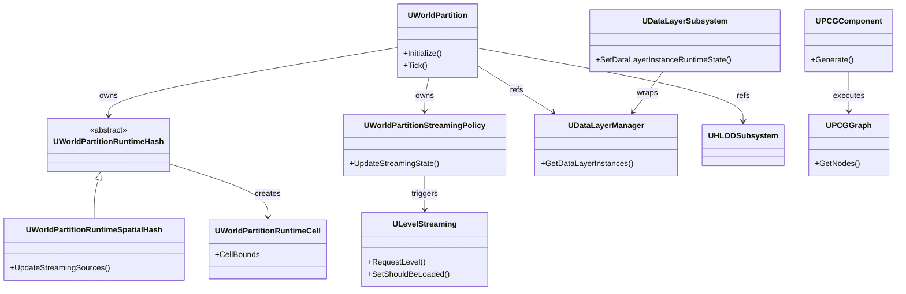

# WorldBuilding ソースマップ

- 対象: WorldPartition / LevelStreaming / DataLayer / HLOD / PCG
- 更新日: 2026-04-18
- 上位: [[_module_index]]

---

## モジュール構成

| モジュール | パス | ファイル数 | 説明 |
|-----------|------|----------|------|
| WorldPartition (Public) | `Engine/Source/Runtime/Engine/Public/WorldPartition/` | 64 h + 15 sub-dirs | WP コアヘッダー群 |
| WorldPartition (Private) | `Engine/Source/Runtime/Engine/Private/WorldPartition/` | 155 cpp | WP 実装 |
| DataLayer | `Engine/.../WorldPartition/DataLayer/` | 26 h / 22 cpp | データレイヤー |
| HLOD | `Engine/.../WorldPartition/HLOD/` | 27 h / 23 cpp | 階層 LOD |
| RuntimeHashSet | `Engine/.../WorldPartition/RuntimeHashSet/` | 7 h / 10 cpp | ランタイムハッシュ（新方式） |
| RuntimeSpatialHash | `Engine/.../WorldPartition/RuntimeSpatialHash/` | 1 h / 2 cpp | 空間ハッシュ（レガシー） |
| ContentBundle | `Engine/.../WorldPartition/ContentBundle/` | 15 h / 13 cpp | コンテンツバンドル |
| LevelStreaming | `Engine/Source/Runtime/Engine/Classes/Engine/LevelStreaming*.h` | 6 h / 3 cpp | レベルストリーミング |
| PCG | `Engine/Plugins/PCG/Source/PCG/` | 400 h / 547 cpp | プロシージャルコンテンツ生成 |

---

## 主要ファイル → クラス対応

### WorldPartition コア

| ファイル | 主要クラス/構造体 | 役割 | BP公開 |
|---------|-----------------|------|--------|
| `WorldPartition.h` | `UWorldPartition` | WP管理の中核。Initialize/Tick/ストリーミング制御 | No |
| `WorldPartitionRuntimeHash.h` | `UWorldPartitionRuntimeHash` | ランタイムハッシュ基底クラス | No |
| `WorldPartitionRuntimeSpatialHash.h` | `UWorldPartitionRuntimeSpatialHash` | 空間ハッシュによるセル分割 | No |
| `WorldPartitionRuntimeCell.h` | `UWorldPartitionRuntimeCell` | ランタイムセル基底 | No |
| `WorldPartitionRuntimeCellData.h` | `UWorldPartitionRuntimeCellData` | セルデータ（バウンド等） | No |
| `WorldPartitionRuntimeLevelStreamingCell.h` | `UWorldPartitionRuntimeLevelStreamingCell` | レベルストリーミングセル | No |
| `WorldPartitionLevelStreamingPolicy.h` | `UWorldPartitionStreamingPolicy` | ストリーミングポリシー | No |
| `WorldPartitionLevelStreamingDynamic.h` | `UWorldPartitionLevelStreamingDynamic` | 動的レベルストリーミング | No |
| `WorldPartitionStreamingSource.h` | `FWorldPartitionStreamingSource` | ストリーミングソース（カメラ等） | No |
| `WorldPartitionActorDesc.h` | `FWorldPartitionActorDesc` | アクタ記述子（エディタ時） | No |
| `WorldPartitionActorDescInstance.h` | `FWorldPartitionActorDescInstance` | アクタ記述子インスタンス | No |
| `WorldPartitionBlueprintLibrary.h` | `UWorldPartitionBlueprintLibrary` | BP 向けユーティリティ | Yes |
| `WorldPartitionSubsystem.h` | `UWorldPartitionSubsystem` | ランタイムサブシステム | Yes |

### DataLayer

| ファイル | 主要クラス/構造体 | 役割 | BP公開 |
|---------|-----------------|------|--------|
| `DataLayerAsset.h` | `UDataLayerAsset` | データレイヤーアセット定義 | Yes |
| `DataLayerInstance.h` | `UDataLayerInstance` | レイヤーインスタンス（ワールド内） | No |
| `DataLayerInstanceWithAsset.h` | `UDataLayerInstanceWithAsset` | アセットベースのインスタンス | No |
| `DataLayerManager.h` | `UDataLayerManager` | レイヤー管理 | No |
| `DataLayerSubsystem.h` | `UDataLayerSubsystem` | ランタイムサブシステム（状態管理） | Yes |
| `DataLayerType.h` | `EDataLayerType` | Runtime / Editor 列挙 | — |
| `DataLayerLoadingPolicy.h` | `UDataLayerLoadingPolicy` | ロードポリシー | No |
| `ExternalDataLayerAsset.h` | `UExternalDataLayerAsset` | 外部データレイヤー | No |
| `ExternalDataLayerManager.h` | `UExternalDataLayerManager` | 外部DL管理 | No |
| `WorldDataLayers.h` | `AWorldDataLayers` | ワールド設定アクタ | No |

### HLOD

| ファイル | 主要クラス/構造体 | 役割 | BP公開 |
|---------|-----------------|------|--------|
| `HLODActor.h` | `AWorldPartitionHLOD` | HLOD アクタ | No |
| `HLODActorDesc.h` | `FHLODActorDesc` | HLOD アクタ記述子 | No |
| `HLODBuilder.h` | `UHLODBuilder` | HLOD ビルド処理 | No |
| `HLODLayer.h` | `UHLODLayer` | HLOD レイヤー設定 | Yes |
| `HLODSubsystem.h` | `UHLODSubsystem` | HLOD ランタイムサブシステム | No |
| `HLODRuntimeSubsystem.h` | `UHLODRuntimeSubsystem` | ランタイム HLOD 管理 | No |
| `HLODDestruction.h` | — | HLOD 破壊連携 | No |
| `DestructibleHLODComponent.h` | `UDestructibleHLODComponent` | 破壊可能 HLOD コンポーネント | No |

### LevelStreaming

| ファイル | 主要クラス/構造体 | 役割 | BP公開 |
|---------|-----------------|------|--------|
| `LevelStreaming.h` | `ULevelStreaming` | レベルストリーミング基底 | Yes |
| `LevelStreamingDynamic.h` | `ULevelStreamingDynamic` | 動的レベルストリーミング | Yes |
| `LevelStreamingAlwaysLoaded.h` | `ULevelStreamingAlwaysLoaded` | 常時ロード | No |
| `LevelStreamingVolume.h` | `ALevelStreamingVolume` | ボリュームベースストリーミング | Yes |
| `LevelStreamingDelegates.h` | `FLevelStreamingDelegates` | ストリーミングデリゲート | No |

### PCG（主要のみ — 全体で 947 ファイル）

| ファイル | 主要クラス/構造体 | 役割 | BP公開 |
|---------|-----------------|------|--------|
| `PCGComponent.h` | `UPCGComponent` | PCG コンポーネント | Yes |
| `PCGGraph.h` | `UPCGGraph` | PCG グラフ | Yes |
| `PCGNode.h` | `UPCGNode` | グラフノード | No |
| `PCGElement.h` | `IPCGElement` | ノード実行インターフェース | No |
| `PCGContext.h` | `FPCGContext` | 実行コンテキスト | No |
| `PCGData.h` | `UPCGData` | データ基底 | No |
| `PCGSubsystem.h` | `UPCGSubsystem` | PCG サブシステム | Yes |
| `PCGSettings.h` | `UPCGSettings` | ノード設定基底 | No |
| `Data/PCGPointData.h` | `UPCGPointData` | ポイントデータ | No |
| `Data/PCGSpatialData.h` | `UPCGSpatialData` | 空間データ基底 | No |
| `Elements/` | 各種 `UPCGSettings` 派生 | 標準ノード（202 h） | 一部 Yes |

---

## エントリポイント

### WorldPartition

| 関数 | ファイル:行 | 説明 |
|------|-----------|------|
| `UWorldPartition::Initialize()` | `WorldPartition.cpp:492` | WP 初期化（World 設定時） |
| `UWorldPartition::Tick()` | `WorldPartition.cpp:1797` | 毎フレーム更新（エディタハッシュ更新） |
| `UWorldPartitionSubsystem::UpdateStreamingStateInternal()` | `WorldPartition.cpp:901` | ストリーミング状態更新 |

### DataLayer

| 関数 | ファイル:行 | 説明 |
|------|-----------|------|
| `UDataLayerSubsystem::SetDataLayerInstanceRuntimeState()` | `DataLayerSubsystem.h:53` | レイヤーのランタイム状態変更 |
| `UDataLayerSubsystem::GetDataLayerInstanceRuntimeState()` | `DataLayerSubsystem.h:44` | 現在の状態取得 |
| `UDataLayerSubsystem::GetDataLayerInstanceEffectiveRuntimeState()` | `DataLayerSubsystem.h:48` | 実効状態取得 |

### LevelStreaming

| 関数 | ファイル:行 | 説明 |
|------|-----------|------|
| `ULevelStreaming::RequestLevel()` | `LevelStreaming.h:708` | レベルロードリクエスト |
| `ULevelStreaming::SetShouldBeLoaded()` | `LevelStreaming.h:447` | ロード要求フラグ設定 |
| `ULevelStreaming::SetShouldBeVisible()` | `LevelStreaming.h:434` | 可視性フラグ設定 |

### PCG

| 関数 | ファイル:行 | 説明 |
|------|-----------|------|
| `UPCGComponent::Generate()` | `PCGComponent.h` | PCG グラフ実行トリガー |
| `UPCGComponent::CleanupLocal()` | `PCGComponent.h` | 生成結果のクリーンアップ |
| `UPCGSubsystem::RegisterOrUpdatePCGComponent()` | `PCGSubsystem.h` | コンポーネント登録 |

---

## 主要 CVar

| CVar | デフォルト | 説明 |
|------|----------|------|
| `wp.Runtime.EnableServerStreaming` | `0` | サーバーサイドストリーミング有効化 |
| `wp.Runtime.UpdateStreaming` | `1` | ストリーミング更新の有効/無効 |
| `wp.Runtime.HLOD` | `1` | HLOD の有効/無効 |
| `wp.Editor.EnableStreaming` | `0` | エディタでのストリーミング有効化 |

---

## クラス関連図（概略）

---

## 備考

- WorldPartition のソースは `Engine/Public/WorldPartition/` と `Engine/Private/WorldPartition/` に分散（全 200+ ファイル）
- PCG は独立プラグイン（947 ファイル）で非常に大規模。標準ノードだけで `Elements/` に 202 ヘッダ
- HLOD と DataLayer は WorldPartition のサブディレクトリとして実装されている
- ContentBundle は UE5.3+ で追加された新機能で、DataLayer と連携する
