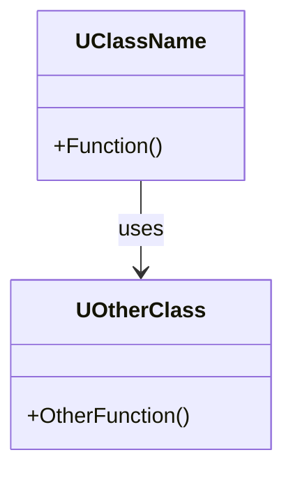

# {SystemName} ソースマップ

- 対象: `{ソースパスの一覧}`
- 更新日: YYYY-MM-DD
- 上位: [[_module_index]]

---

## モジュール構成

| モジュール | パス | 説明 |
|-----------|------|------|
| {ModuleName} | `Engine/Source/Runtime/{Path}/` | モジュールの役割 |

## 主要ファイル → クラス対応

| ファイル | 主要クラス/構造体 | 役割 | BP公開 |
|---------|-----------------|------|--------|
| `ClassName.h` | `UClassName` | 役割の説明 | Yes/No |
| `StructName.h` | `FStructName` | 役割の説明 | — |

## エントリポイント

処理フローの起点となる関数。`ue5-dive` で調査を始める際の出発点。

| 関数 | ファイル:行 | 説明 |
|------|-----------|------|
| `UClassName::Function()` | `File.cpp:123` | いつ呼ばれるか・何をするか |
| `AActorName::Tick()` | `File.cpp:456` | Tick 駆動の処理 |

## 主要 CVar

| CVar | デフォルト | 説明 |
|------|----------|------|
| `system.VarName` | `1` | 機能の On/Off |

## クラス関連図（概略）

## 備考

- ソースマップは `ue5-doc` のフェーズ 0 で作成する
- `ue5-dive` での調査中に新しいエントリポイントを発見したら随時追記する
- 行番号はソース変更で古くなる可能性がある — 参照時に実際のソースを確認すること
